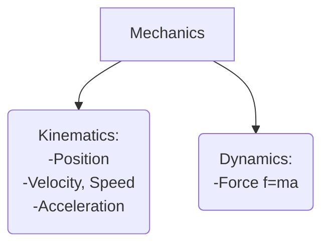

# Motion in one Dimension

## Objectives

- Study relationship between a particle’s displacement and its initial and final positions.
- Work on relationship between a particle’s average velocity, its displacement, and the time interval for that displacement.
- Given a graph of a particle’s position versus time, ­ determine the average velocity between any two particular times.

<!-- pause -->

> First, what does one dimensional motion mean?

> The study of motion of bodies (particles) is called _mechanics_.

<!--end_slide-->



<!--pause-->

- We categorize motions as translational, rotational and vibrational.

- Our first focus will be _ideal particle_ motion.
- It is basically a particle with no "inner structure" like electron.
- As an example we can think of Earth motion around the Sun as a point particle motion. However for the Earth's motion around its axis we should consider it as a rigid body.

<!--end_slide-->

### Absolute motion, time

- _Newton, Principia_ (1687): "Absolute space, in its own nature, without relation to anything external, remains always similar and immovable."

<!--new_line-->

- _Newton, Principia_ (1687): "Absolute, true, and mathematical time, of itself, and from its own nature, flows equably without relation to anything external, and by another name is called duration."

<!--pause-->

> How do we define motion in this "absolute" space?

- The answer is to use relative motion or _observers_.

> Note that not all observers or reference frames are equivalent!

<!--end_slide-->

## Position

- A _particle position_ x is the location of particle
  with respect to a chosen reference point that we can
  consider to be the origin of a coordinate
  system.
- We can represent position in three different ways. Tabular pictorial or graphical.

<!--pause-->

<!-- column_layout: [2, 3] -->
<!-- column: 0 -->


<!-- column: 1 -->


<!--new_line-->

<!--end_slide-->


<!--pause-->

## Displacement, distance

- Given position data we can now define the _displacement_ as follows

```latex +render
$\Delta x = x_f -x_i$
```

<!--pause-->

> Note that this is different than total distance! Where total distance is always positive the displacement can be negative too!

> Displacement is a _vector_ quantity, i.e. it has direction and magnitude.

<!--end_slide-->

- By contrast total distance is a _scalar_ quantity. It doesn't have any directions, only numerical value.

- For an example consider a basketball player. If a player runs from his own team’s
  basket down the court to the other team’s basket and then returns to his own basket, the displacement of the player during this time interval is zero because he ended
  up at the same point as he started:

```latex +render
$\Delta x= 0, \quad x_f = x_i$
```

## Average velocity

> Through displacement we define _average velocity_ as follows

```latex +render +width:50%
$v_{x,avg} = \dfrac{\Delta x}{\Delta t}=\dfrac{x_f -x_i}{t_f - t_i}$
```

<!--end_slide-->


- Graph for calculating average velocity.

<!--end_slide-->

> Average speed is defined as following. (Note that just like total distance speed is also a scalar quantity.)

```latex +render +width:15%
$v = \dfrac{d}{\Delta t}$
```

### Instantaneous velocity

- Now the question is how to define the velocity of a particle at time t.


<!--end_slide-->

> From the picture we can see the _instantaneous velocity_ (or from now on we call it just velocity) is the following limit

```latex +render
$$v_{x}=\lim_{\Delta t\to 0}\dfrac{\Delta x}{\Delta t}=\dfrac{dx}{dt}$$
```

<!--new_line-->

> Then instantaneous speed is as defined as the magnitude of instantaneous velocity.

<!--pause-->
<!--new_line-->

- Consider the following one-dimensional motions: (A) a ball thrown directly upward rises to a highest point and falls back into the thrower’s hand; (B) a race car starts from rest and speeds up to 100 m/s; and (C) a spacecraft drifts through space at constant velocity. Are there any points in the motion of these objects at which the instantaneous velocity has the same value as the average velocity over the entire motion? If so, identify the point(s).

<!--end_slide-->

-Consider a particle moving along x axis. It is
position is given by.

```latex +render
$x=-4t+2t^{2}$
```

- Determine the displacement of the particle in the time intervals t=0
  to t=1 and t=1 to t=3.
- Calculate the average velocity in these intervals.
- Find the instantaneous velocity at t=2.5.

<!--end_slide-->

## Particle moving under constant velocity

> The distance covered by a particle moving in one direction (lets say x) is the following

```latex +render +width:35%
$x_f = x_i + v_x t$
```

> Note that a particle moving with _constant speed_ can change direction!


<!--end_slide-->

## Acceleration

> When the velocity of the particle changes with time it is called particle is accelerating. Average acceleration is given by

```latex +render +width:45%
$a_{x,avg} = \dfrac{v_{xf}-v_{xi}}{t_f-t_i}=\dfrac{\Delta v_x}{\Delta t}$
```


<!--end_slide-->

### Instantaneous acceleration

> Just like instantaneous velocity we have instantaneous acceleration.

```latex +render +width:35%
$$a_x = \lim_{\Delta t\to 0} \dfrac{\Delta v_{x}}{\Delta t}=\dfrac{dv_x}{dt}=\dfrac{d^{2}x}{dt^{2}}$$
```


<!--end_slide-->

## Particle under constant acceleration

> For a constant acceleration the following _kinematic_ equations hold

- Velocity after time t.

```latex +render
$v_{fx}=v_{fi}+a_{x}t$
```

<!--pause-->

- Position after time t.

```latex +render
$x_f= x_i +v_{xi}t+\frac{1}{2}a_x t^{2}$
```

<!--pause-->

- "Timeless" velocity and position formula

```latex +render
$v_{fx}^{2} = v_{xi}^{2}+2 a_x(x_f-x_i)$
```

<!--pause-->

> All of these can also be derived using calculus (easier).

<!--end_slide-->

### Free Fall Acceleration

- If you tossed an object either up or down and could somehow eliminate the
  ­ effects of air on its flight, you would find that the object accelerates down-
  ward at a certain constant rate. That rate is called the free-­ fall acceleration,
  and its magnitude is represented by g. The acceleration is independent of
  the object’s characteristics, such as mass, density, or shape; it is the same for
  all objects.


