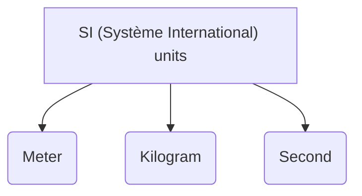
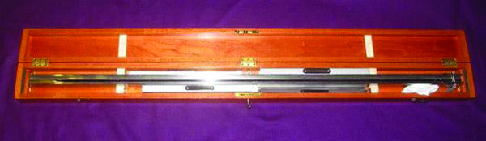
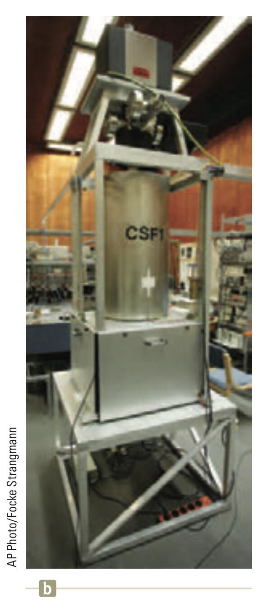
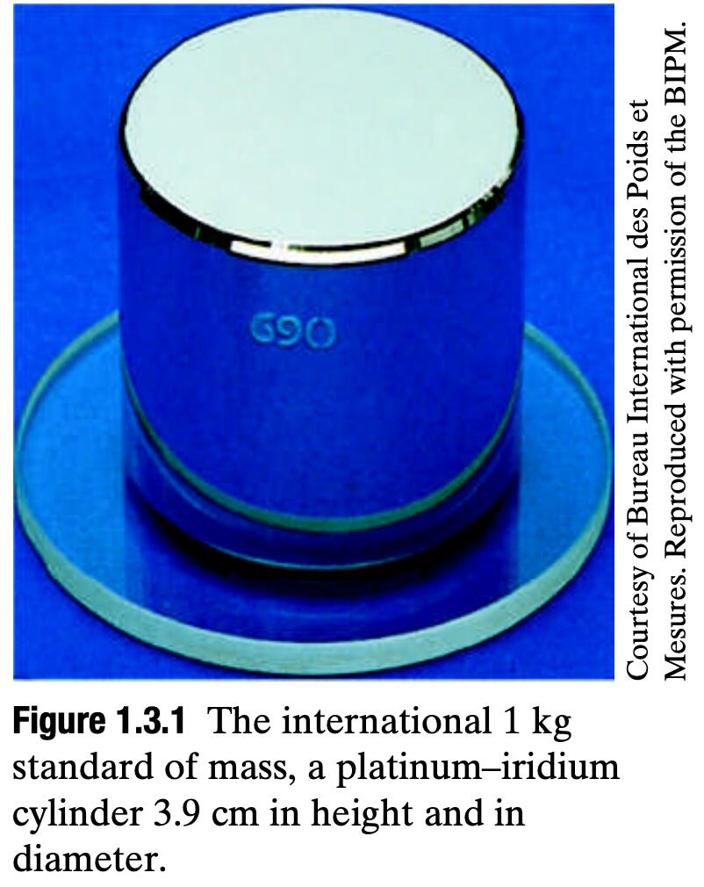
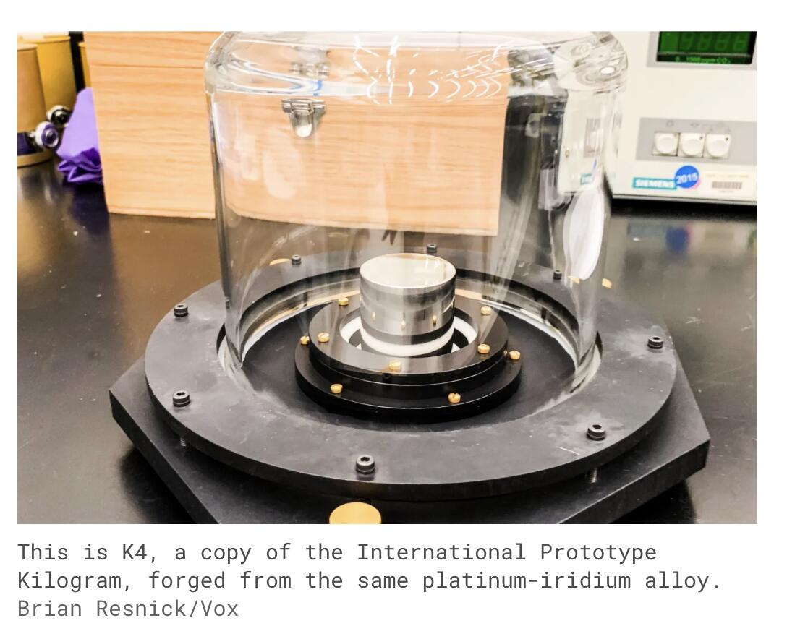
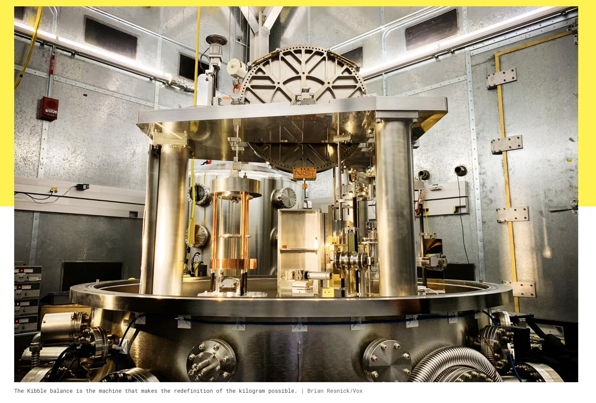
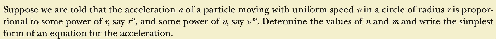

# Measurement

## Objectives

- What does physics do?
- Understand units.
- What are the fundamental units.
- Conversions.
- Significant Figures.

<!-- pause -->

## Physics and Experiment

- Like all other sciences, physics is based on experimental observations and
  quantitative measurements.

- The main objectives of physics are to identify a limited number of fundamental laws that govern natural phenomena and use them to develop theories that can predict the future experiments. (Search for Thomas Kuhn, Karl Popper).

- When there is a discrepancy between the prediction of a theory and experimental results, new or modified theories must be formulated to remove discrepancy.

- For example (Newtonian mechanics → Einstein theory of relativity) (Blackbody radiation → Quantum mechanics )

<!-- end_slide -->

## Standarts of Length, Mass, Time

- To describe natural phenomena we need measurements.

<!-- pause -->
<!-- new_line -->

**Base quantities** : There are so many physical quantities that it is a problem to organize them. Fortunately, they are not all independent; for example, speed is the ratio of a length to a time.

- In mechanics we have three fundamental quantities _length, mass_ and _time_.
- In order to reproduce experiments we need _standards_.

<!-- pause -->



- In 1960 a committee established set of standarts for the above quantities. (There are also extras Kelvin, Ampere, Candela, Mole)

<!--end_slide-->

### Length

> Can be identified as the distance between two points in space.

<!--pause-->

- (_yard_: Distance from the tip of the nose to the end of
  outstretched arm of the King of England!)

- The French standard until 1799, _meter_ is defined as
  one ten-millionth of the distance from the equator to the
  North Pole along one particular longitudinal line
  that passes from Paris.

- As recently as 1960, the length of meter was defined as the
  distance between two lines on a specific platinum-iridium
  bar in France.

<!--pause-->

> In 1983 meter was finally redefined as the distance traveled
> by light in vacuum. During a time of 1/ 299792458
> second.



<!--end_slide-->

### Time

- Before 1967, the standard of time was the mean solar day. The fundamental unit of a second
  was (1/60)x(1/60)x(1/24) of a mean solar day.

<!--pause-->

> In 1967 second is defined as 9162631770 times
> the period of vibration of radiation from the cesium-133 atom.

<!-- column_layout: [2, 3] -->
<!-- column: 0 -->



<!-- column: 1 -->

<!--new_line-->

A cesium fountain atomic clock. The clock will neither gain nor lose a second in 20
million years.

<!-- end_slide -->

### Mass

- The SI standard of mass is a cylinder of platinum and iridium that
  is kept at the International Bureau of Weights and Measures near Paris and
  assigned, by international agreement, a mass of 1 kilogram.

<!--pause-->

- The U.S. copy of the standard kilogram is housed in a vault at NIST. It
  is ­ removed, no more than once a year, for the purpose of checking duplicate
  ­ copies that are used elsewhere. Since 1889, it has been taken to France twice for
  recomparison with the primary standard.

<!-- column_layout: [2, 2] -->
<!-- column: 0 -->



<!-- column: 1 -->



<!-- end_slide -->

- A far more accurate way of measuring mass is now being adopted. In a Kibble balance (named after its inventor Brian Kibble), a standard mass can be measured when the downward pull on it by gravity is balanced by an upward force from a magnetic field due to an electrical current. The precision of this technique comes from the fact that the electric and magnetic properties can be determined in terms of quantum mechanical quantities that have been precisely defined or measured.



[](http://www.vox.com/science-and-health/2018/11/14/18072368/kilogram-kibble-redefine-weight-science)

<!-- end_slide -->

## Dimensional Analysis

- The symbols we use in this book to specify the dimensions of length, mass, and time
  are L, M, and T, respectively.
- We shall often use brackets [ ] to denote the dimensions of a physical quantity.

```latex +render
 $\text{speed}\rightarrow [v] = \frac{L}{T},\quad\text{area}\rightarrow [A]=L^{2}$
```

<!-- pause -->

- A dimensional analysis example



<!-- end_slide -->

## Conversion

- We often need to change the units in which a physical quantity is expressed.
  We do so by a method called _chain-link_ conversion. In this method, we multiply
  the original measurement by a conversion factor (a ratio of units that is equal
  to unity).


<!--end_slide-->

### Some famous conversion errors

- On September 23, 1999 NASA lost the $125 million Mars Climate Orbiter spacecraft after a 286-day journey to Mars. Miscalculations due to the use of English units instead of metric units apparently sent the craft slowly off course 60 miles in all. Thrusters used to help point the spacecraft had, over the course of months, been fired incorrectly because data used to control the wheels were calculated in incorrect units. Lockheed Martin, which was performing the calculations, was sending thruster data in English units (pounds) to NASA, while NASA's navigation team was expecting metric units (Newtons).

<!--new_line-->

- On January 26, 2004 at Tokyo Disneyland's Space Mountain, an axle broke on a roller coaster train mid-ride, causing it to derail. The cause was a part being the wrong size due to a conversion of the master plans in 1995 from English units to Metric units. In 2002, new axles were mistakenly ordered using the pre-1995 English specifications instead of the current Metric specifications

<!--end_slide-->

## Significant figures and Decimal places

- When certain quantities are measured, the measured values are known only to
  within the limits of the experimental uncertainty.

- The number of _significant figures_ in a measurement can be used to express something about the uncertainty.

### Rules for determining number of significant figures

- Non-zero digits are significant. For example 365 (3 --> significant).
<!--pause-->
- Zeros in between other digits are significant. For example 6.003 (4 --> significant).
<!--pause-->
- Leading zeros are not significant. For example 0.0075 (2 --> significant)
<!--pause-->
- Trailing decimal zeros are significant. For example (3.50 --> 3 significant, 2300 --> 2 significant)

<!--end_slide-->

### Rules for calculating significant figures

- When multiplying several quantities, the number of significant figures in the
  final answer is the same as the number of significant figures in the quantity having the smallest number of significant figures. The same rule applies to division.

```latex +render
$A= \pi r^{2} = \pi (6.0 \text{cm})^{2}= 1.1\times 10^{2} \text{cm}^{2}$
```

<!--pause-->
<!--new_line-->

- When numbers are added or subtracted, the number of decimal places in the
  result should equal the smallest number of decimal places of any term in the
  sum or difference.

```typst +render
$23.2+5.174 =28.4$
```

<!--end_slide-->

State the number of sig figs in each value:

1. 0.00004050

2. 54,700

3. 1,000.09

4. 0.039

<!--pause-->

Complete the calculations to the correct number of sig figs:

1. 5.4589 - 2.33

2. 16.872 + 3.8

3. 2.33 × 18

4. 31.9 / 7.318
