# Chapter 10 -- Rotation

<!--pause-->

## Objectives

- Introduce the rotational variables.
- Relation between angular and translational quantities.
- Introduce Torque.
- Computation of Moment of Inertia.
- Rotational energy.
- Rolling Motion.

<!--pause-->

## Angular position, velocity and acceleration

- When an extended object such as a wheel rotates about its axis, the motion cannot be
  analyzed by modeling the object as a particle because at any given time different parts of the
  object have different linear velocities and linear accelerations.

<!--pause-->
<!--new_line-->

- In dealing with a rotating object, analysis is greatly simplified by assuming the object is
  rigid. A rigid object is one that is non-deformable; that is, the relative locations of all particles of which the object is composed remain constant.

<!--end_slide-->

<!--pause-->

<!-- column_layout: [2, 5] -->
<!-- column: 0 -->

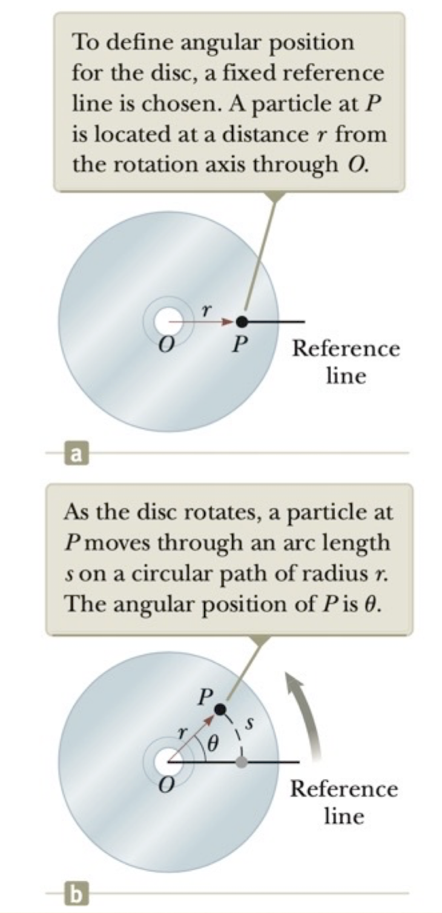

<!-- column: 1 -->

```typst +render
#set text(font:"DejaVu Sans Mono",30pt)
A small element of the disc modeled as a particle at P is at \
a fixed distance $r$ from the origin and rotates about it in a circle \
of radius $r$. (In fact, every element of the disc undergoes circular \
motion about O.) It is convenient to represent the position of $P$ \
with its polar coordinates $(r, theta)$, where $r$ is the distance from the \
origin to P and $theta$ is measured counterclockwise from some reference \
line fixed in space as shown.
```

<!--pause-->

```typst +render
#set text(font:"DejaVu Sans Mono",20pt)
Because the disc in figure is a rigid object, as the particle \
moves through an angle $theta$ from the reference line, every \
other particle on the object rotates through the same angle \
$theta$. Therefore, we can associate the angle $theta$ with \
the entire rigid object as well as with an individual particle,\
which allows us to define the angular position of a rigid object \
in its rotational motion.
```

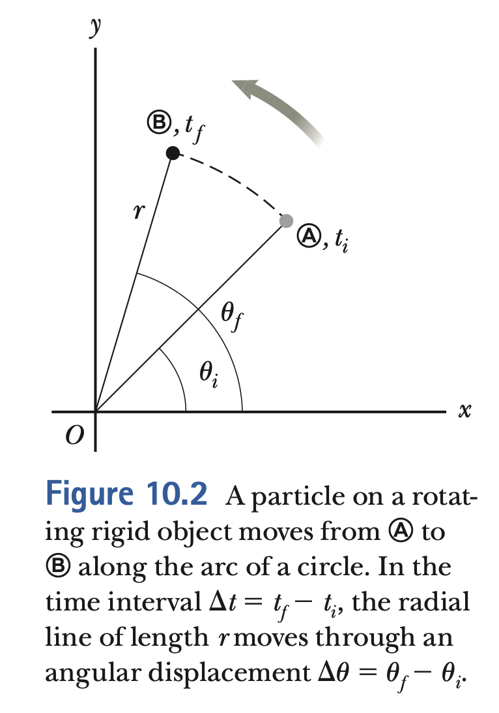

<!--end_slide-->

- From angular position we can define angular displacement, angular speed and angular acceleration.

- Angular speed

```latex +render +width:40%
\begin{eqnarray}
\Delta \theta &= \theta_f -\theta_i , \quad \omega_{avg}&=\frac{\theta_f-\theta_i}{t_f-t_i}\\
\omega &= \lim_{\Delta t \to 0}\frac{\Delta \theta}{\Delta t}=\frac{d \theta}{d t}\\
\end{eqnarray}
```

<!--pause-->

- Angular acceleration

```latex +render
\begin{eqnarray}
\alpha_{avg} &= \frac{\omega_f-\omega_i}{t_f-t_i}  \\
\alpha &= \lim_{\Delta t \rightarrow 0}\frac{\Delta \omega}{\Delta t}=\frac{d \omega}{d t}
\end{eqnarray}
```

<!--end_slide-->

## Angular quantities as vectors

<!-- column_layout: [1, 2] -->
<!-- column: 0 -->

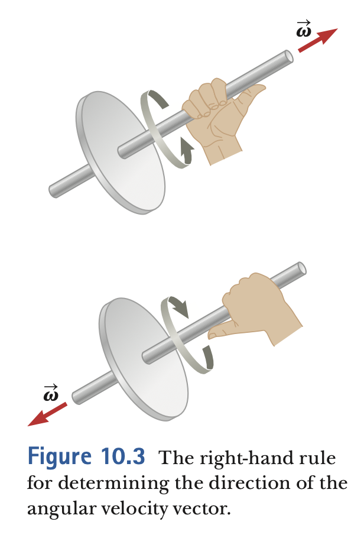

<!--column: 1 -->

- In the same way, a rigid body rotating about a fixed axis can rotate only
  clockwise or counterclockwise as seen along the axis, and again we can select
  ­ between the two directions by means of plus and minus signs.

<!--new_line-->

- It is not easy to get used to representing angular quantities as vectors. We
  instinctively expect that something should be moving along the direction of a
  vector. That is not the case here. Instead, something (the rigid body) is
  rotating around the direction of the vector.

<!--end_slide-->

> Angular Displacements. Now for the caution: Angular displace-
> ments (unless they are very small) cannot be treated as vectors.


<!--end_slide-->

## Rigid object under constant acceleration

- Just like in translational motion we can study the case for a body under constant angular acceleration. The results are given in the table below.

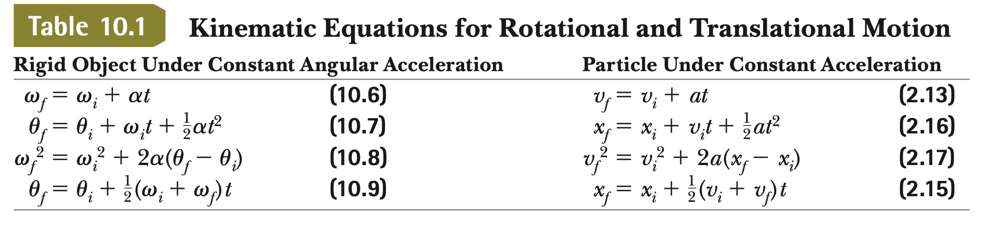
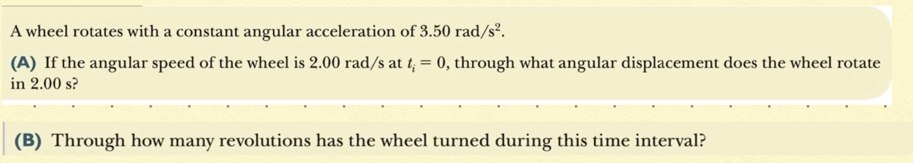

<!--end_slide-->

## Angular and translational quantities

<!-- column_layout: [1, 2] -->
<!--column: 0-->

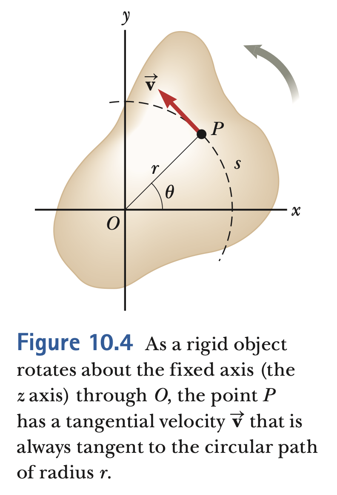

<!-- column: 1 -->

- Because point P in figure moves in a circle, the translational velocity
  vector v is always tangent to the circular path and hence is called tangential
  velocity. The magnitude of the tangential velocity of the point P is by
  definition the tangential speed v = ds/dt, where s is the distance traveled by
  this point measured along the circular path.

```latex +render +width:40%
\begin{equation}
v=\frac{ds}{dt}=r\frac{d\theta}{dt}=r\omega
\end{equation}
```

<!--pause-->

- We can relate the angular acceleration of the rotating rigid object to the
  tangential acceleration of the point P by taking the time derivative of v:

```latex +render
\begin{equation}
a_t=\frac{dv}{dt}=r\frac{d\omega}{dt}=r\alpha
\end{equation}
```

<!--end_slide-->

- In addition to the tangential acceleration we have the centripetal acceleration as before.

<!-- column_layout: [1, 2] -->
<!--column: 0-->

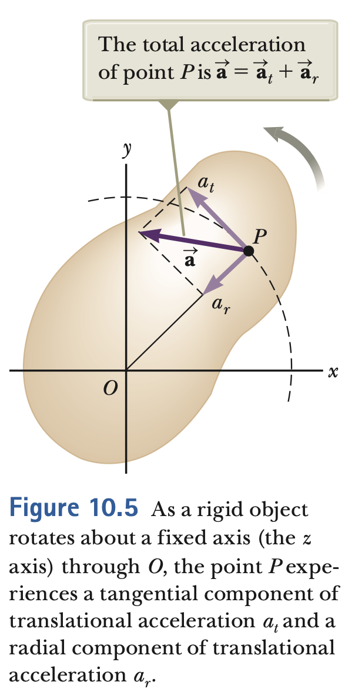

<!--column: 1-->

```latex +render
\begin{equation}
a_c = \frac{v^{2}}{r}=\omega^{2}r
\end{equation}
```

- Total acceleration will be the sum of two vectors.

```latex +render
\begin{equation}
\vec a = \vec a_t +\vec a_c
\end{equation}
```

<!--end_slide-->

## Torque

- In our study of translational motion, after investigating the description of
  motion, we studied the cause of changes in motion: force. We follow the same
  plan here: What is the cause of changes in rotational motion?

```typst +render
#set text(font:"DejaVu Sans Mono",5pt)
When a force is exerted on a rigid object pivoted about an axis, \
the object tends to rotate about that axis. The tendency of a force \
to rotate an object about some axis is measured by a quantity called \
torque $tau$ (Greek letter tau). Torque is a vector, but we will \
consider only its magnitude here; we will explore its vector nature later.
```

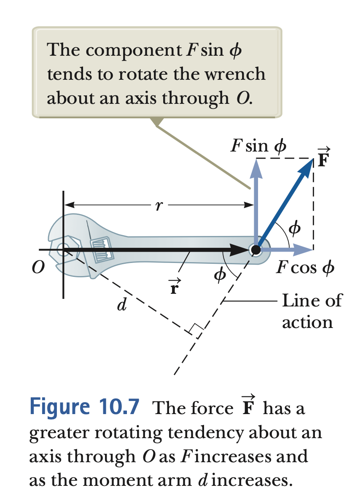

<!--end_slide-->

```typst +render
#set text(font:"DejaVu Sans Mono",10pt)
We define the magnitude of the torque $arrow(tau)$ associated with \
the force $arrow(F)$ around the axis passing through $O$ by the expression
```

```latex +render
\[\tau = r F \sin\theta= F d\]
```

<!--pause-->

- If there are two or more forces acting on an object as in figure, we use the
  convention the sign of the torque causing a counterclockwise position positive
  and clockwise negative, therefore.

<!-- column_layout: [1, 2] -->
<!-- column: 0 -->

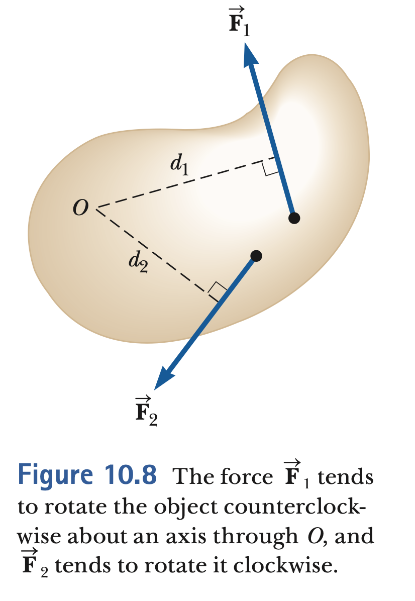

<!-- column: 1 -->

```latex +render
\[\Sigma \tau = \tau_1+\tau_2 = F_1 d_1-F_2 d_2\]
```

- _There is no unique value
  of the torque on an object. Its
  value depends on your choice of
  rotation axis!_

<!--end_slide-->

- What is the total torque on the solid cylinder on the left figure?

<!-- column_layout: [1, 2] -->
<!-- column: 0 -->

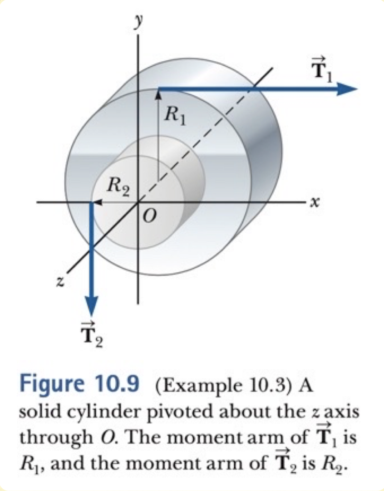

<!-- column: 1 -->

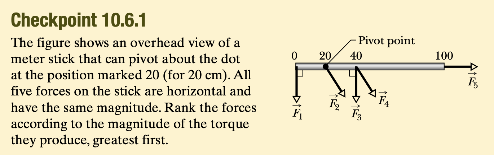

<!--end_slide-->

## Rigid Object Under a Net Torque

<!-- column_layout: [1, 2] -->
<!-- column: 0 -->

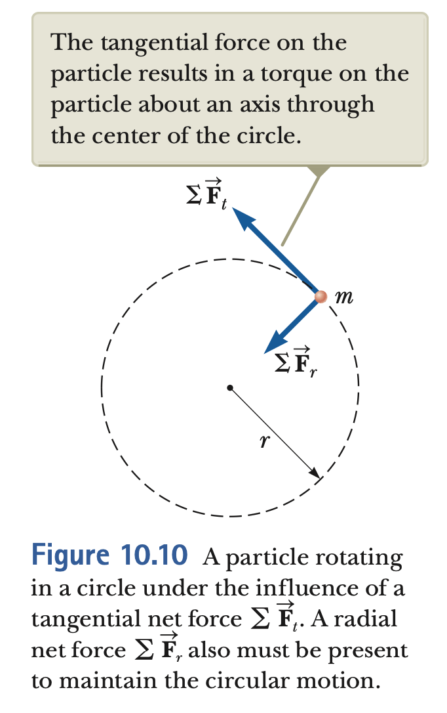

<!-- column: 1 -->

- In this section, we show the rotational analog of Newton’s second law: the
  angular acceleration of a rigid object rotating about a fixed axis is
  proportional to the net torque acting about that axis.

```latex +render
\[\text{From first law, tangential force has acceleration}\quad \Sigma F=m a_t\]
```

<!--pause-->

- The net torque on mass m is

```latex +render
\[\Sigma \tau=\Sigma F_t r=m a_t r= m r^{2}\alpha = I \alpha\]
```

- Finally, the net torque acting on the particle is proportional to its angular acceleration.

```latex +render
\[\Sigma \tau=I \alpha\]
```

<!--end_slide-->

<!-- column_layout: [1, 2] -->
<!-- column: 0 -->

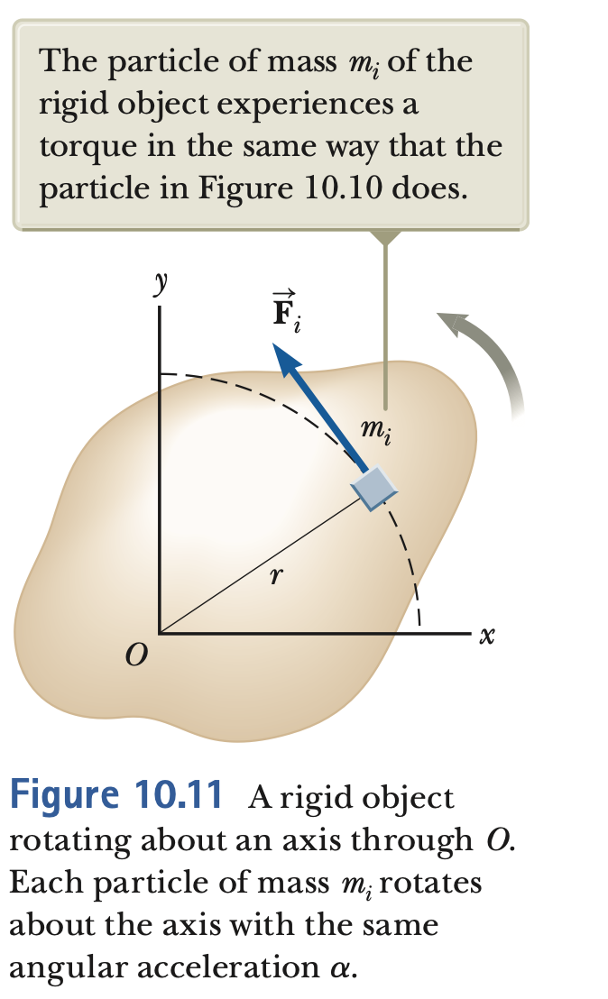

<!-- column: 1 -->

- Next, consider a rigid object of arbitrary shape rotating about a fixed axis
  O. We can think of this as a collection of particles with mass m, then Newton's
  law for every particle is.

```latex +render
\[\tau_i  = r_i F_i  = m_i r^{2}_i \alpha\]
```

<!--pause-->

- Summing over all particles will give

```latex +render
\[\Sigma \tau_{ext}=\Sigma \tau_i = I \alpha\]
```

- where the quantity I is called _Moment of Inertia_.

```latex +render
\[I = \Sigma m_i r^{2}_i\]
```

<!--end_slide-->

- The moment of inertia is the resistance to changes in rotational motion. This resistance depends not only on the mass of the object, but also on how the mass is distributed around the rotation axis.

- Note that unlike mass m which is an inherent quality for a particle the moment of inertia I depends on your choice of rotation axis.

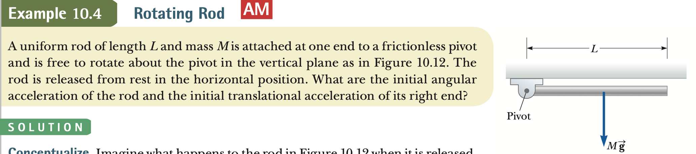

<!--end_slide-->

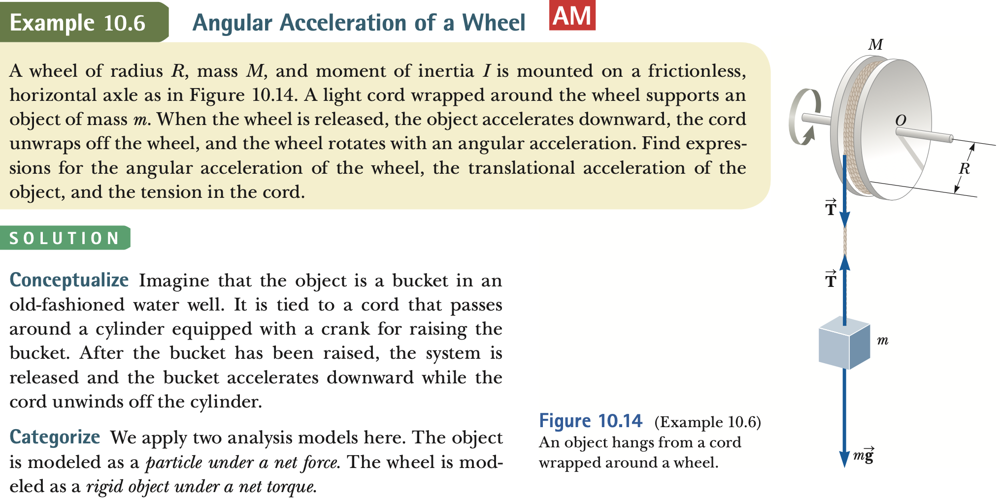

<!--end_slide-->

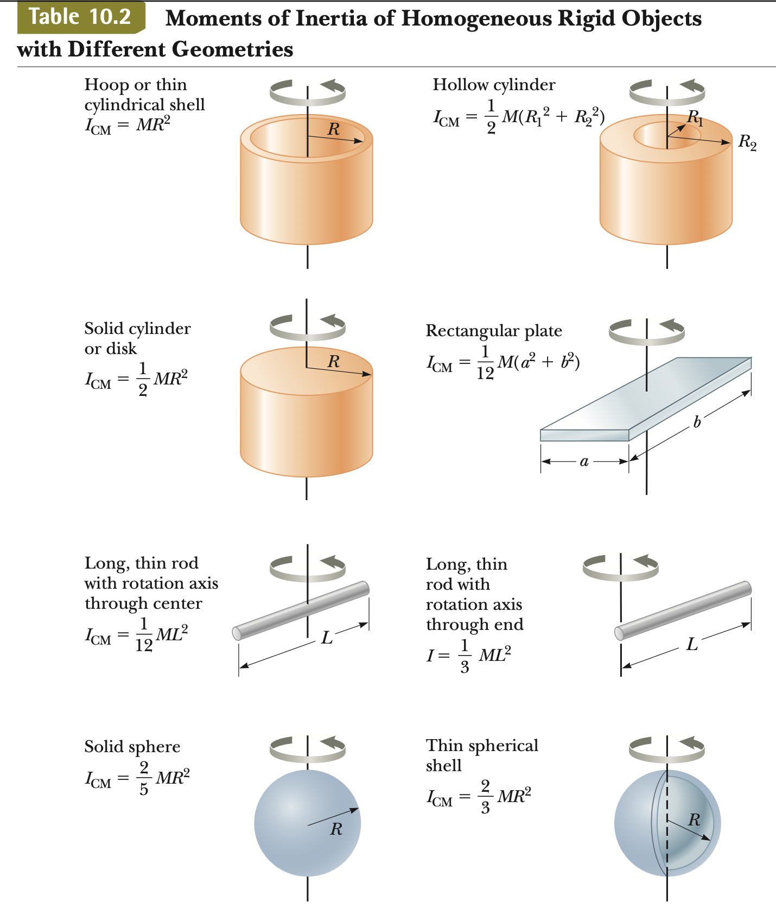

<!--end_slide-->

## Computation of Moment of Inertia

- Similar to computation of CM of an extended object we can imagine the object composed of infinitesimal pieces then sum all contributions.

- Starting with the definition of moment of inertia for discrete particles

```latex +render
\[I=\Sigma r^{2}_{i}m_{i}\]
```

- We can evaluate the moment of inertia of a continuous rigid object by imagining the object to be divided into many small elements, then taking limit

```latex +render
\[I = \lim_{\Delta m_i \rightarrow 0}r^{2}_{i}\Delta m_{i}=\int r^{2} dm\]
```

<!--end_slide-->

### Paralel-Axis Theorem

The calculation of moments of inertia of an object about an arbitrary axis can be
cumbersome, even for a highly symmetric object. Fortunately, use of an important
theorem, called the parallel-axis theorem, often simplifies the calculation.

```latex +render +width:20%
\[I =I_{CM}+M D^{2}\]
```

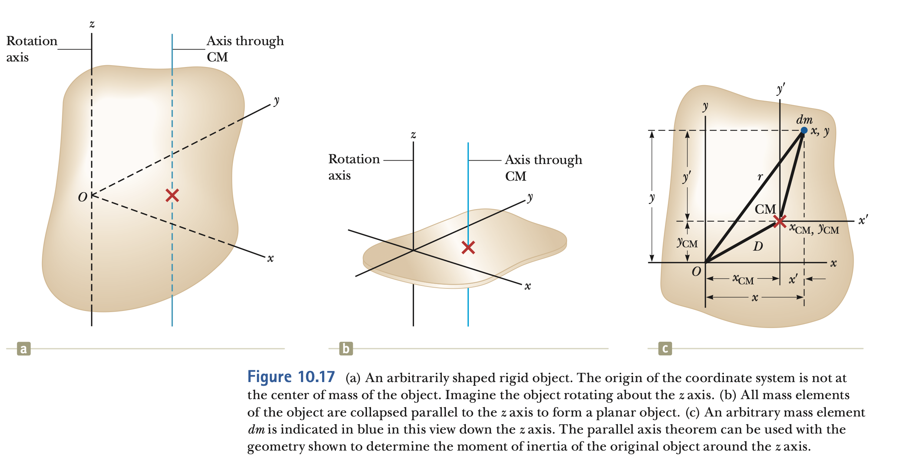

<!--end_slide-->

## Rotational Energy

### Rotational Kinetic Energy

- After investigating the role of forces in our study of translational motion, we turned
  our attention to approaches involving energy. We do the same thing in our current
  study of rotational motion.

<!-- column_layout: [1, 2] -->

<!-- column: 0 -->

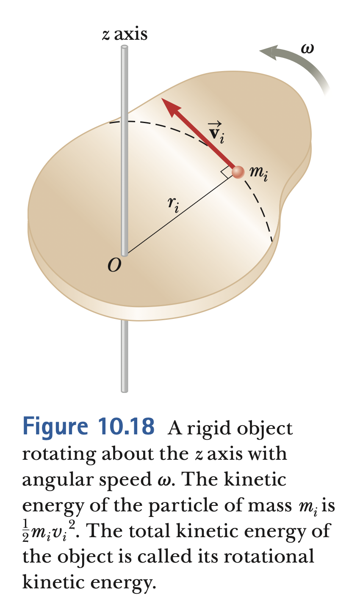

<!-- column: 1 -->

Each particle has kinetic energy

```latex +render +width:35%
$K_i=\frac{1}{2}m_i v_{i}^{2}$
```

Summing this over all particles in the rigid object

```latex +render +width:75%
\[ K_{R}=\Sigma K_{i}=\Sigma \dfrac{1}{2} m_i v_{i}^{2}=\Sigma m_i r_{i}^{2}\omega^{2}\]
```

<!--end_slide-->

- Using definition of moment of inertia final expression can be written as

```latex +render +width:25%
\begin{eqnarray}
K_{R} = &\frac{1}{2} \left(\Sigma m_{i}r_{i}^{2} \right)\omega^{2}\\
=&\frac{1}{2}I \omega^{2}
\end{eqnarray}
```

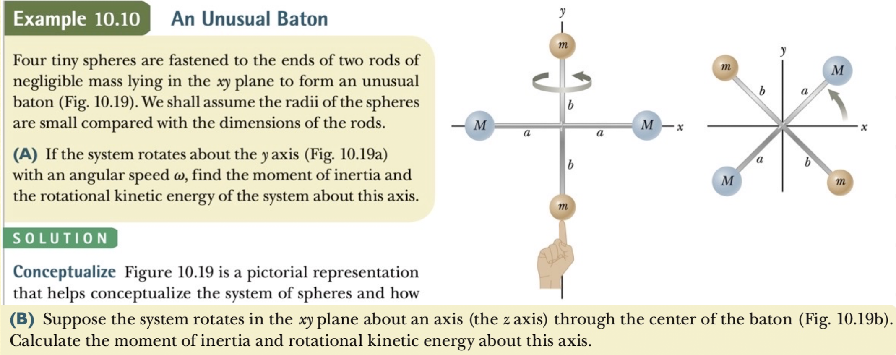

<!--end_slide-->

### Work Done by Torque

- Remember the change of kinetic energy by the work done on a particle

```latex +render
\[\Delta K = \frac{1}{2}m v_{f}^{2}-\frac{1}{2}m v_{i}^{2}\]
```

<!-- column_layout: [1, 2] -->

<!-- column: 0 -->

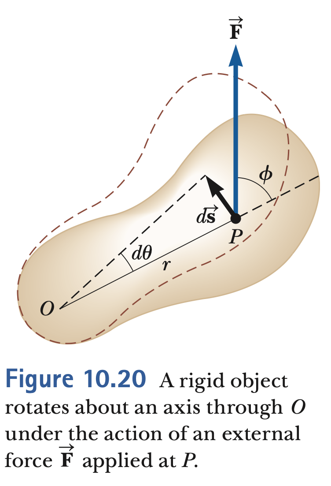

<!-- column: 1 -->

- The work done on the object by F as its point of application rotates

```latex +render
\begin{eqnarray}
dW =& \vec F \cdot \vec ds= (F\sin\phi) r d\theta\\
   =& \tau d\theta
\end{eqnarray}
```

- It is possible to prove

```latex +render
\[W=\frac{1}{2}I\omega_{f}^{2}-\frac{1}{2}I\omega_{i}^{2}\]
```

<!--end_slide-->

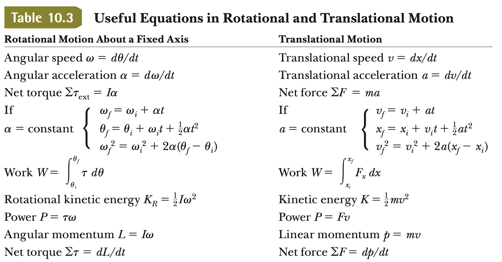

<!--end_slide-->

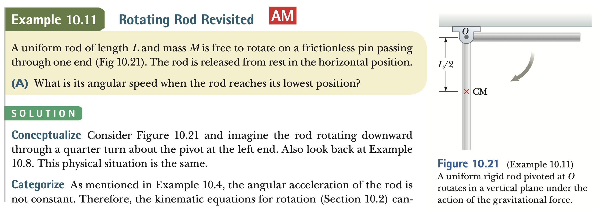
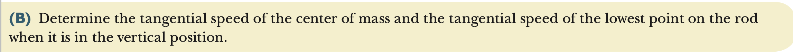

<!--end_slide-->

## Rolling Motion of a Rigid Object

- In this section, we treat the motion of a rigid object rolling along a flat surface. In
  general, such motion is complex. For example, suppose a cylinder is rolling on a
  straight path such that the axis of rotation remains parallel to its initial orientation in space.

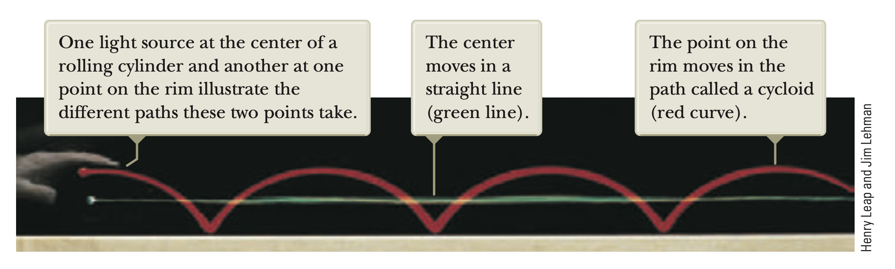

<!--end_slide-->

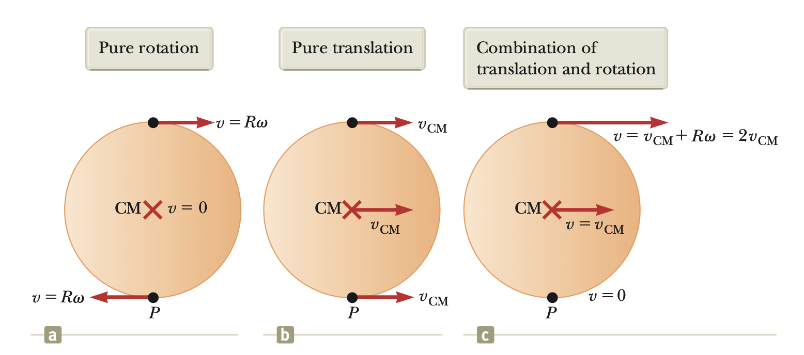

- Imagine that you are moving along with a rolling object at speed vCM, staying
  in a frame of reference at rest with respect to the center of mass of the object. As
  you observe the object, you will see the object in pure rotation around its center
  of mass (fig a).

<!--new_line-->

- In addition to these velocities, every point on the object moves in the same direction with speed vCM relative to the surface on which it rolls (fig b).

<!--new_line-->

- In the reference frame at rest with respect to the surface, the velocity of a given point on the object is the sum of the velocities shown in fig a and fig b.

<!--end_slide-->

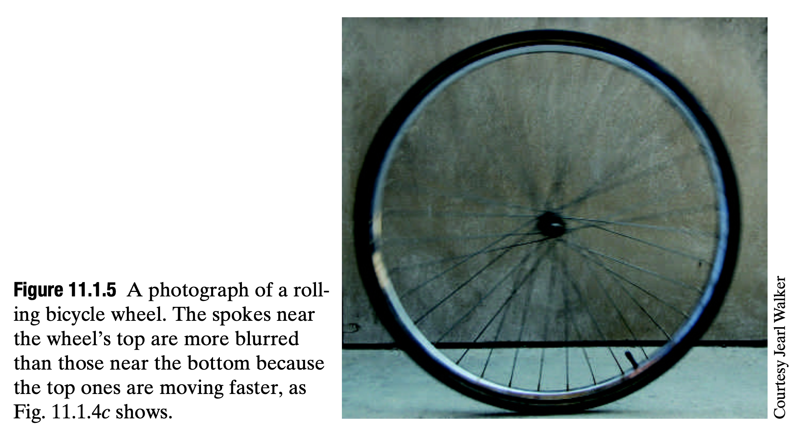

<!--end_slide-->

- Therefore, the total kinetic energy of a rolling object is the sum of the rotational kinetic energy about the center of mass and the translational kinetic energy of the center of mass.

```latex +render
\[K= \frac{1}{2}I_{CM}\omega^{2}+\frac{1}{2}M v_{CM}^{2}\]
```

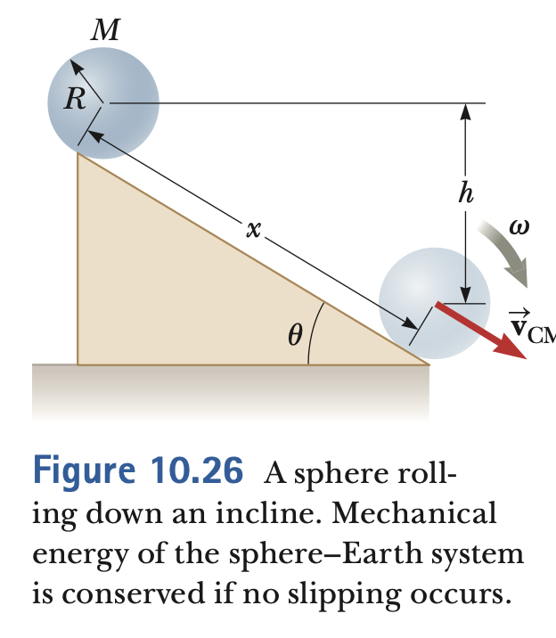

<!--end_slide-->

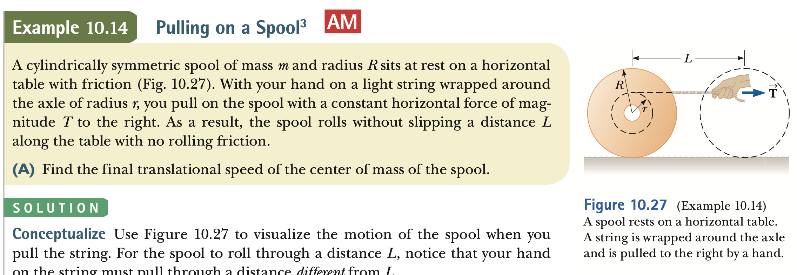

<!--end_slide-->
