# Chapter 11 -- Angular Momentum

- In analogy to the principle of conservation of linear momentum, there is also a principle of conservation of angular momentum. The angular momentum of an isolated system is constant.

- Like the law of conservation of linear momentum, the law of conservation of angular momentum is a fundamental law of physics, equally valid for relativistic and quantum systems.

## Objectives

- Introduce vector (cross) product.
- Define angular momentum.
- Discuss conservation of angular momentum.
- The motion of gyroscopes and tops.

## Vector Product (Cross Product)

- From previous chapter we already know torque is given by the product of distance, force and the sine of the angle between them. In this section we will define the vector product to find the direction of torque. This will also help us in defining the angular momentum.

<!--end_slide-->

```typst +render
#set text(font:"Dejavu Sans Mono",9pt)
Given two vectors $arrow(A)$ and $arrow(B)$ we can define a third vector $arrow(C)$ as \
a vector product of $arrow(A) times arrow(B) = arrow(C)$ where the product has following\
properties

- The magnitude is $| arrow(A) times  arrow(B)| = |arrow(A)| |arrow(B)| sin(phi)$.
- It is not commutative $arrow(A) times arrow(B) = - arrow(B) times arrow(A)$.
- It is distributive $arrow(A) times (arrow(B)+arrow(C))= arrow(A) times arrow(B)+arrow(A) times arrow(C)$.

```

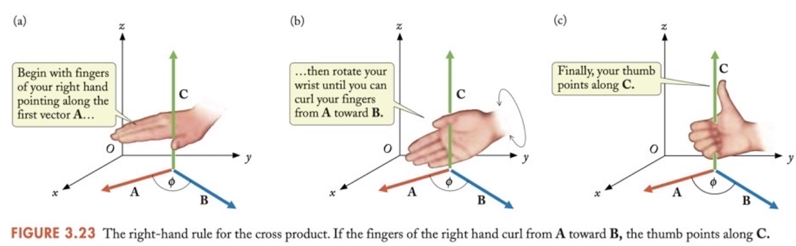

<!--end_slide-->
<!-- column_layout: [2, 3] -->
<!-- column: 1 -->

- Then using the cross product definition torque can be defined as

```latex +render
$\vec{\tau} = \vec r \times \vec F.$
```

- The following determinant can be used to calculate the cross product:

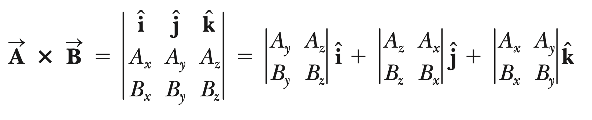

- One can also compute the cross product of two vectors using the rules of unit vectors.

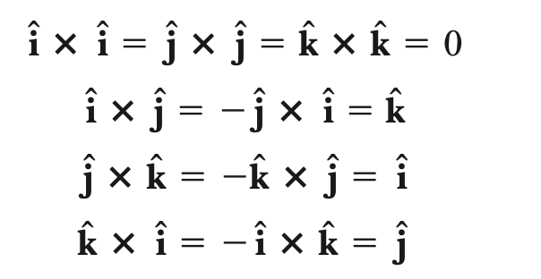

<!-- column: 0-->

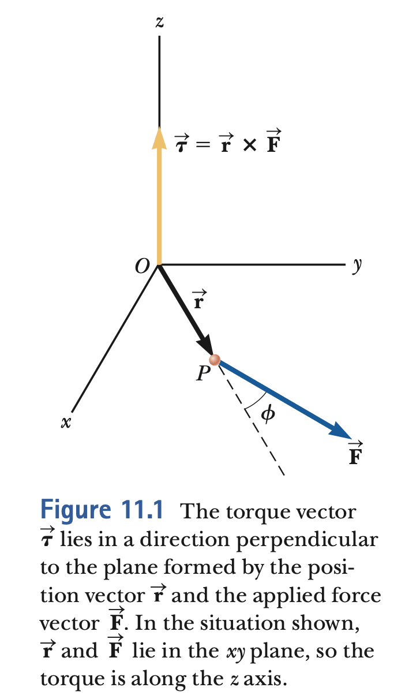

<!--end_slide-->

## Angular Momentum of a single particle

<!-- column_layout: [2, 3] -->
<!-- column: 0 -->

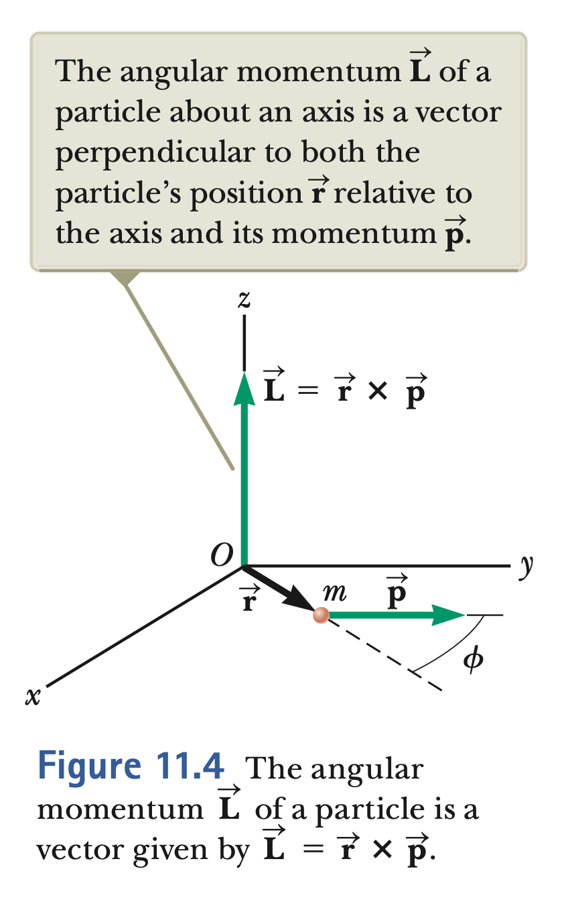

<!-- column: 1 -->

- Consider a particle of mass m located at the vector position r and moving with linear momentum p
  as in figure. In describing translational motion, we found that the net force on the particle equals thetime rate of change of its linear momentum p,

```latex +render
$\Sigma \vec F = \frac{d\vec p}{dt}$
```

- Starting from this equation it is possible to show that

```latex +render
$\Sigma \vec \tau  = \frac{d}{dt}\left(\vec r \times \vec p \right)$
```

> Then we define the angular momentum L as following

```latex +render
\begin{eqnarray}
 \vec L \equiv & \vec r  \times  \vec p \\
\Sigma \vec \tau  = &\frac{d\vec L}{dt}
\end{eqnarray}
```

<!--end_slide-->

- The last equation can be integrated to give the angular impulse-angular momentum relation.

```latex +render
$\Delta \vec L_{total} = \int \Sigma \vec \tau_{ext} dt$
```

<!-- column_layout: [2, 3] -->
<!-- column: 0 -->

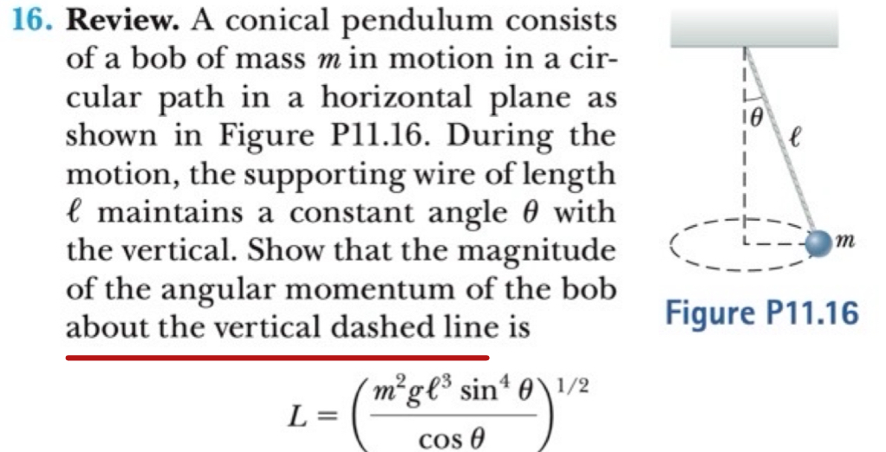

<!-- column: 1 -->

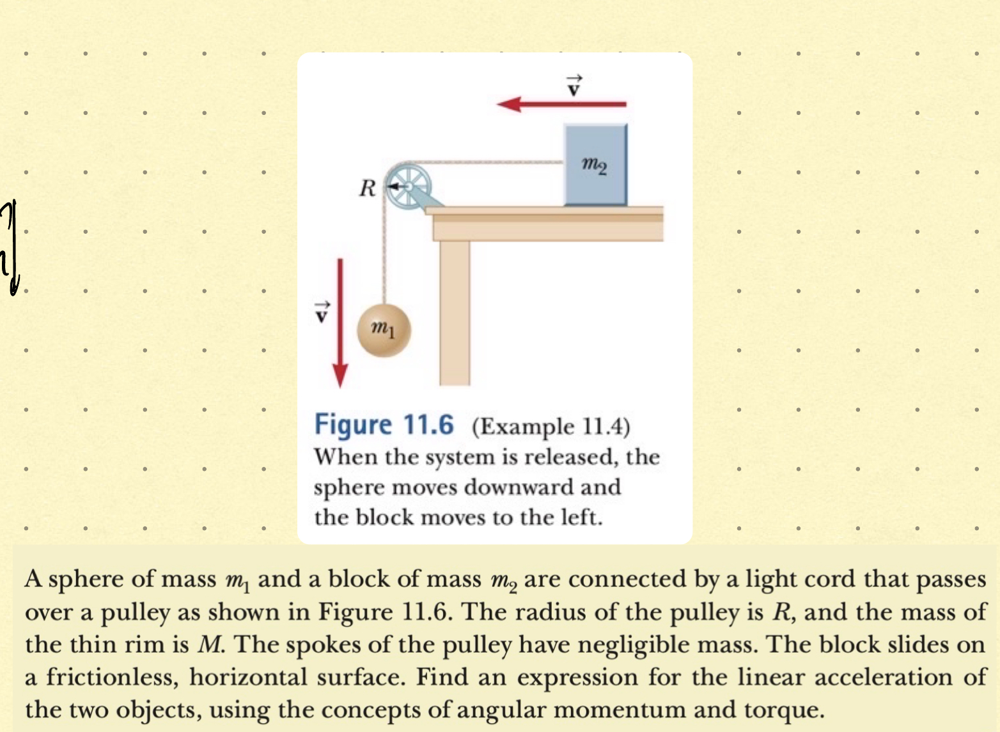

<!--end_slide-->

## Angular Momentum of a Rigid rotating Object

<!-- column_layout: [2, 3] -->
<!-- column: 0 -->

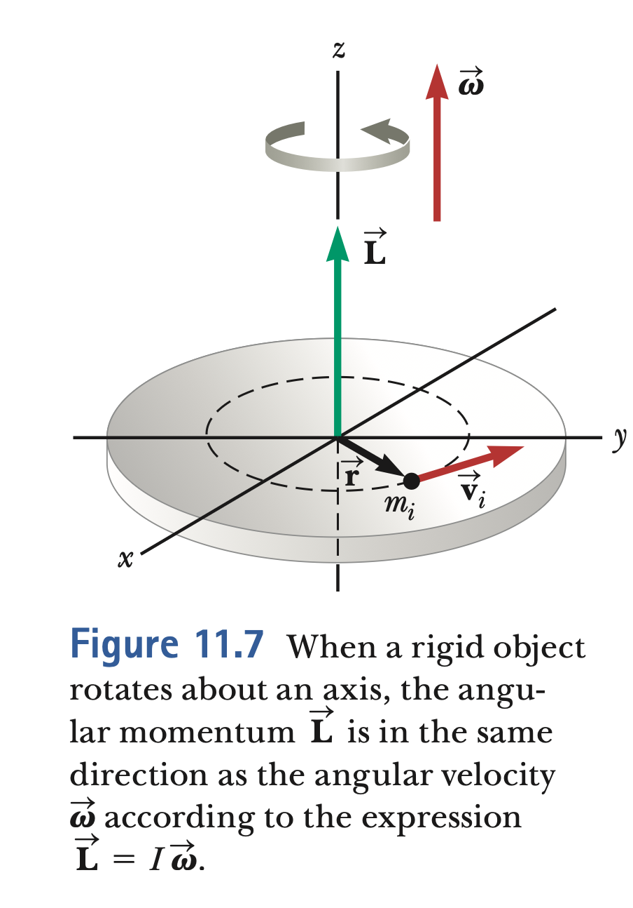

<!-- column: 1 -->

```typst +render
#set text(font:"Dejavu Sans Mono",11pt)
- Each particle of the object rotates \
in the $x-y$ plane about the $z$ axis \
with an angular speed $omega$. The \
magnitude of the angular momentum of \
a particle of mass is $L_i = m_i  r_i v_i$\
which can also be written as $L_i = m_i r_i^2 omega$.

- Summing over all particles we have total L\
#set align(center)
```

```latex +render +width:30%
$L_z = I \omega$
```

- Differentiating this expression we have

```latex +render
$\frac{d\vec L_{z}}{dt}=I\alpha=\Sigma \vec \tau_{ext}$
```

<!--end_slide-->

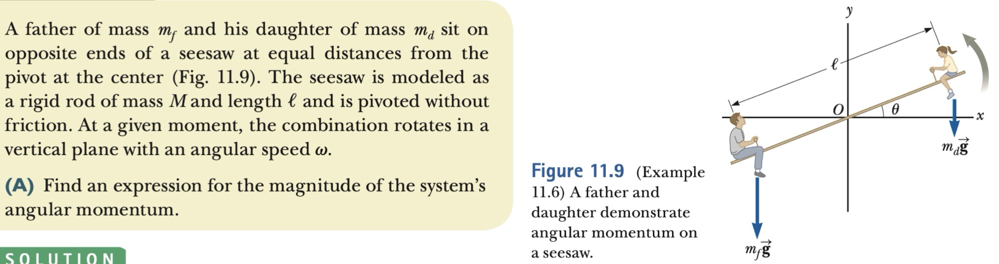

<!--end_slide-->

## Angular Momentum conservation

> The total angular momentum of a system is constant in both magnitude and
> direction if the net external torque acting on the system is zero, that is, if the
> system is isolated.

- The relation between angular impulse and angular momentum is

```latex +render
$\int_{t_1}^{t_2}\vec \tau_{ext} = (\vec L_{tot})_2 -  (\vec L_{tot})_1$
```

- Isolated system means the external torque is zero on the system then

```latex +render
$(\vec L_{tot})_2 =(\vec L_{tot})_1 \quad \Delta L=0$
```

- If the system is deformable and we can change I

```latex +render
$I_i \omega_i = I_f \omega_f$
```

<!--end_slide-->

<!-- column_layout: [2, 2] -->
<!-- column: 0 -->

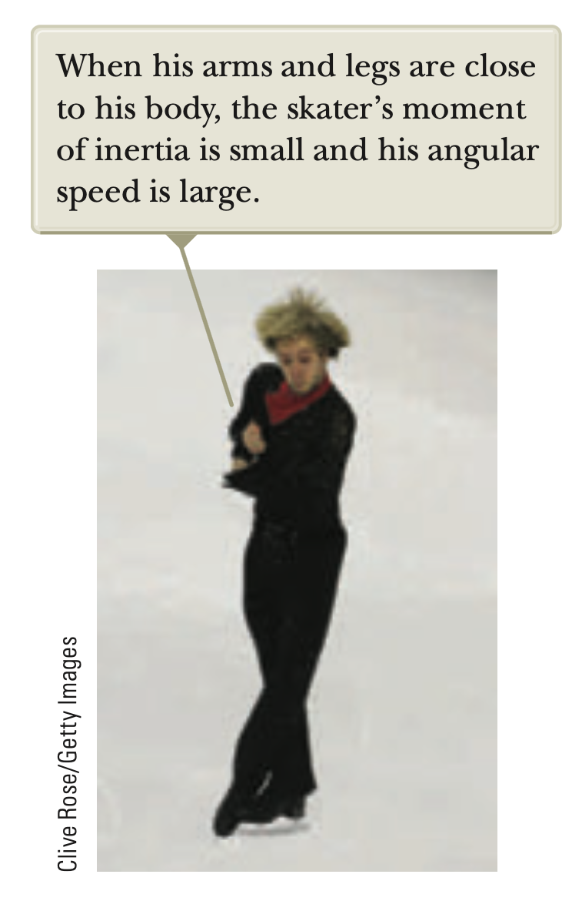

<!-- column: 1 -->

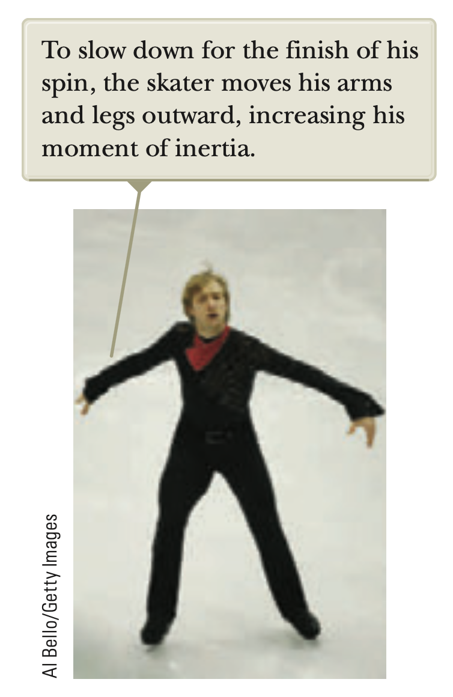

<!--end_slide-->

## Gyroscope Motion

- An unusual and fascinating type of motion you have probably observed is that of a
  top spinning about its axis of symmetry as shown in figure. If the top spins
  rapidly, the symmetry axis rotates about the z axis, sweeping out a cone (see figure).
  The motion of the symmetry axis about the vertical—known as precessional motion is usually slow relative to the spinning motion of the top.

<!-- column_layout: [2, 2] -->
<!-- column: 0 -->

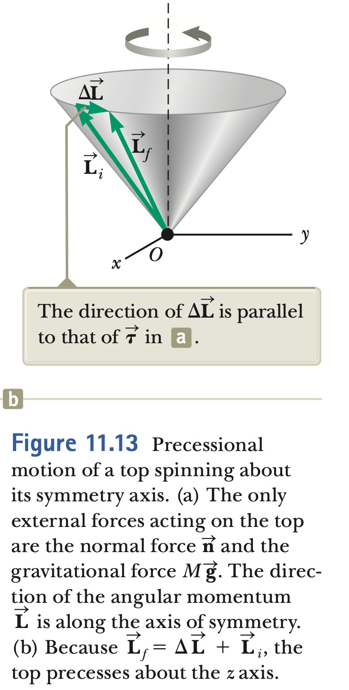

<!-- column: 1 -->

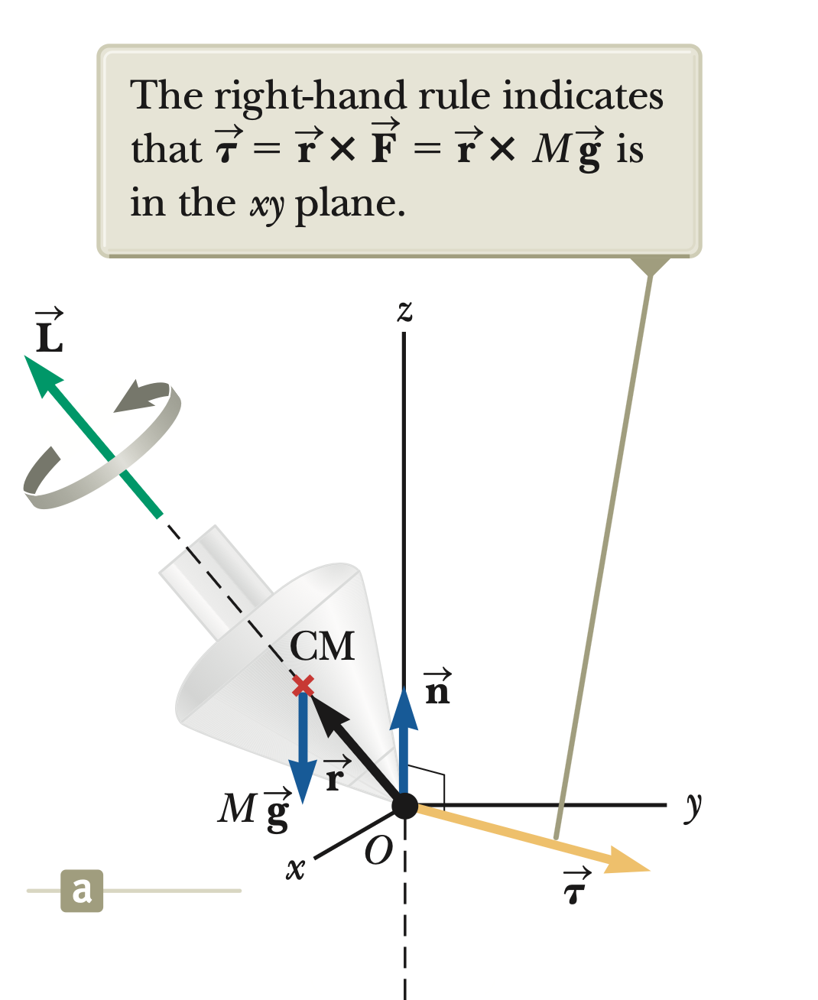

<!--end_slide-->

```typst +render
#set text(font:"DejaVu Sans Mono",10pt)
The essential features of precessional motion can be illustrated by considering \
the simple gyroscope shown in figure. The two forces acting on the gyroscope are \
shown in figure: the downward gravitational force $M arrow(g)$ and the normal force \
$arrow(n)$ upward at the pivot point $O$. The normal force produces no torque about \
an axis passing through the pivot because its moment arm through that point is zero. \
The gravitational force, however, produces a torque $arrow( tau) = arrow(r) M arrow(g)$
about an axis passing \
through $O$, where the direction of $arrow(tau)$ is perpendicular to the plane formed \
by $arrow(r)$ and $M arrow(g)$.
```

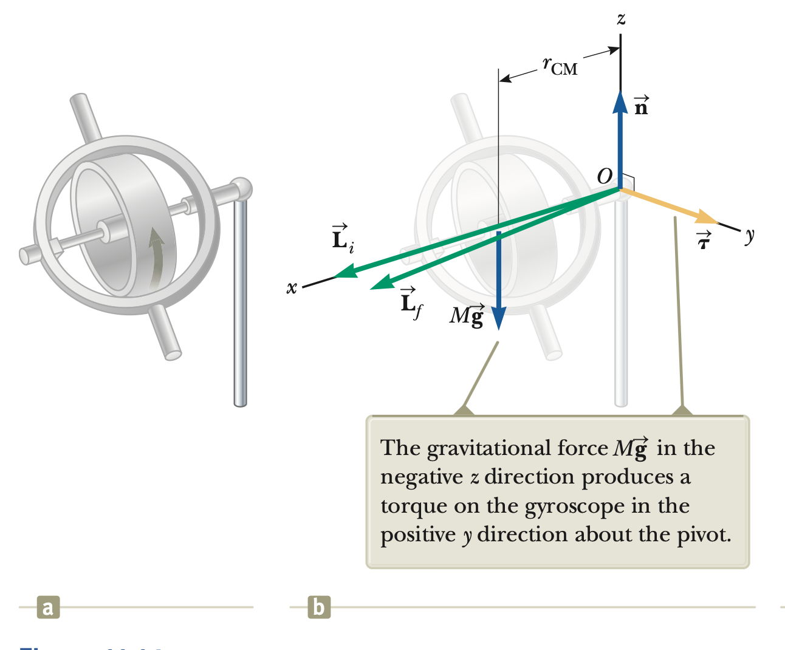

<!--end_slide-->

<!-- column_layout: [2, 2] -->

<!-- column: 0 -->

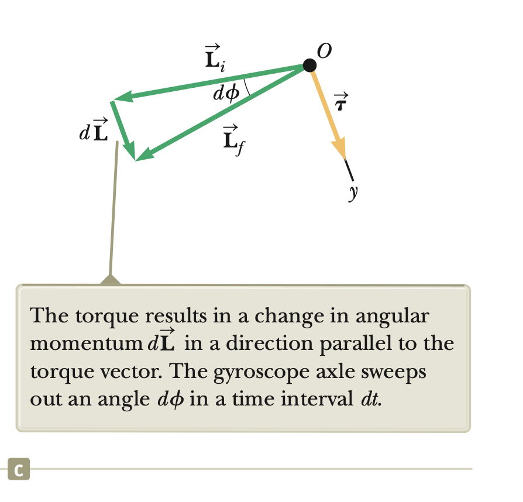

<!-- column: 1 -->

- The net torque and angular momentum of the gyroscope are related through equation

```latex +render
$\Sigma \vec \tau_{ext}= \frac{d\vec L}{dt}$
```

- From the figure we see that the change in momentum is

```latex +render
$d\phi = \frac{dL}{L} =\frac{\Sigma \vec \tau_{ext}}{L}=\frac{(M g r_{CM})dt}{L}$
```

- Using the angular momentum definition, we find precession frequency

```latex +render
$\omega_p = \frac{d\phi}{dt} =\frac{Mg r_{CM}}{I\omega}$
```
