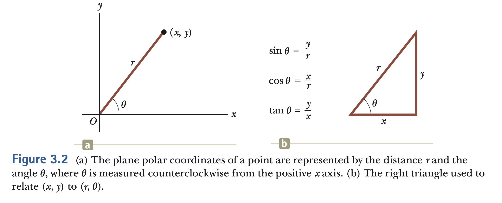
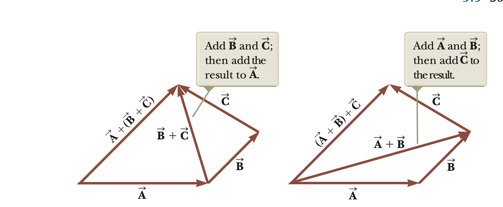
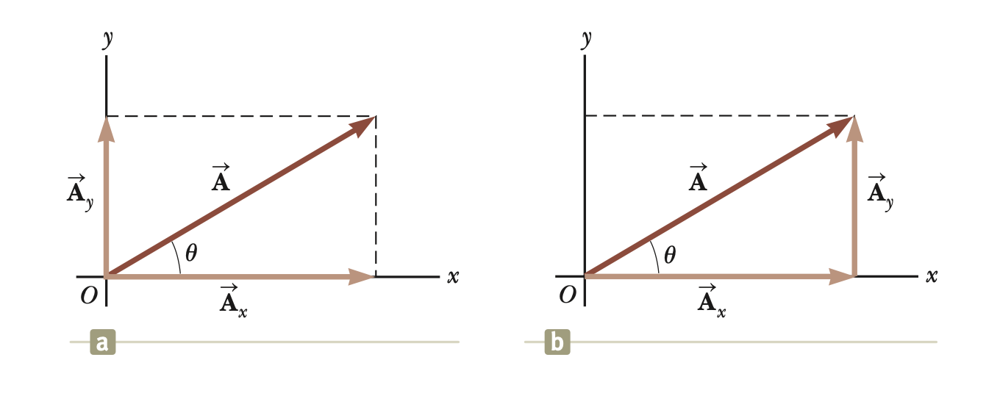

# Vectors

## Objectives

- Define vectors and investigate their general properties.
- Calculating components of a vector on a given coordinate system, show them in a drawing.
- Addition and subtraction of vectors.

<!-- pause -->

## Coordinate Systems

- In order to describe a position in space we need coordinate systems.



<!--end_slide-->

> The Cartesian coordinates of a point in the xy plane are (x, y) = (-3.50, -2.50), find the polar coordinates for this point.

## Vector and Scalar quantities

> A _scalar_ quantity is completely specified by a single value with an appropriate unit and has no direction.

```typst +render
#set text(font:"Dejavu Sans Mono",7pt)
- Usual law of arithmetic applies.
- examples: Temperature, mass, speed, total distance...
```

<!--pause-->

> A _vector_ quantity is completely specified by a number with an appropriate unit (the magnitude of the vector) plus a direction.

```typst +render
#set text(font:"DejaVu Sans Mono",7pt)
- examples : Displacement, velocity, gravitational force, electromagnetic force...
- The notation to represent a vector is $arrow(V)$.
- In order to represent magnitude we use $|arrow(V)|$.
- Note that the magnitude is always greater than 0, $|arrow(V)| gt.eq 0$
```

<!--end_slide-->

### Some properties of vectors

```typst +render
#set text(font:"DejaVu Sans Mono",9pt)
- Two vectors $arrow(A)$ and $arrow(B)$ are equal if and only if they have \
the same magnitude i.e., $|arrow(A)|=|arrow(B)|$ and they are parallel $arrow(A)parallel arrow(B)$ .
```

<!--pause-->

> _Adding vectors_ = It can be conveniently described by the graphical method.


<!--end_slide-->

```typst +render
#set text(font:"DejaVu Sans Mono",8pt)
- Note that addition in commutative $arrow(A)+arrow(B)=arrow(B)+arrow(A)$.
- It is also associative $arrow(A)+(arrow(B)+arrow(C))=(arrow(A)+arrow(B))+arrow(C)$.
```



<!--pause-->

> _Negative of a vector_ = The negative of the vector is defined as the vector that
> when added to self it gives zero.

```typst +render
#set text(font:"DejaVu Sans Mono",9pt)
$arrow(A)+arrow(-A)=0$.
```

```typst +render
#set text(font:"DejaVu Sans Mono",9pt)
- We define the operation $arrow(A)-arrow(B)$ as vector $-arrow(B)$ is added to vector $arrow(A)$.
```

<!--end_slide-->

```typst +render
#set text(font:"DejaVu Sans Mono",9pt)
- If a vector $arrow(A)$ is multiplied by a positive scalar $m$ the resulting vector \
will be in same direction as $arrow(A)$ and magnitude $m|arrow(A)|$.
```


<!--pause-->

### Components of a vector

- It is better to work the components of a vector when high accuracy is required. We are going to make use of projections of vectors along coordinate axes.



<!--end_slide-->

### Unit vectors

```typst +render
#set text(font:"DejaVu Sans Mono",7pt)
- A unit vector is a dimensionless vector having a magnitude of 1.
- We shall use $hat(i),hat(j),hat(k)$ to denote unit  \ vectors pointing in the positive $x,y,x$ directions.
- Note that $|hat(i)|=|hat(j)|=|hat(k)|=1$
```


