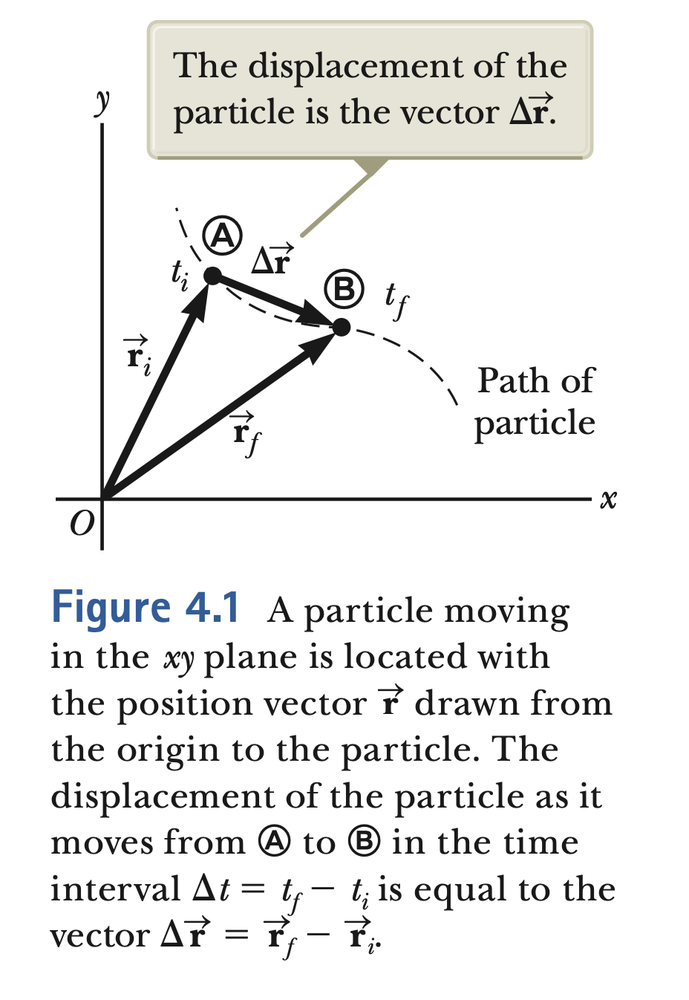
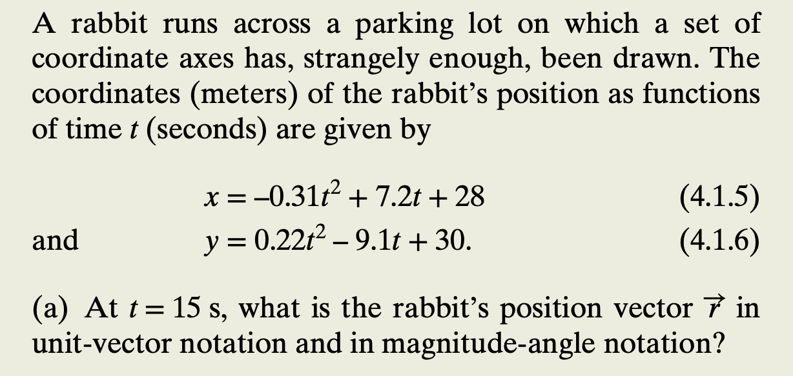
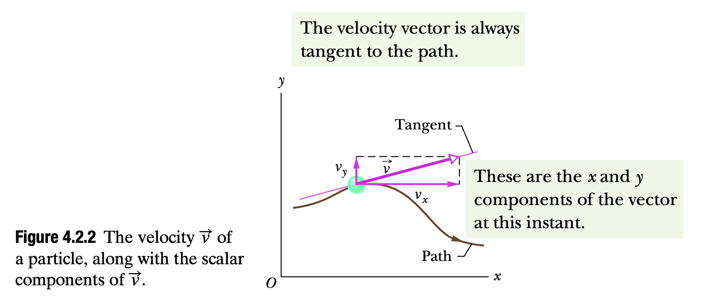
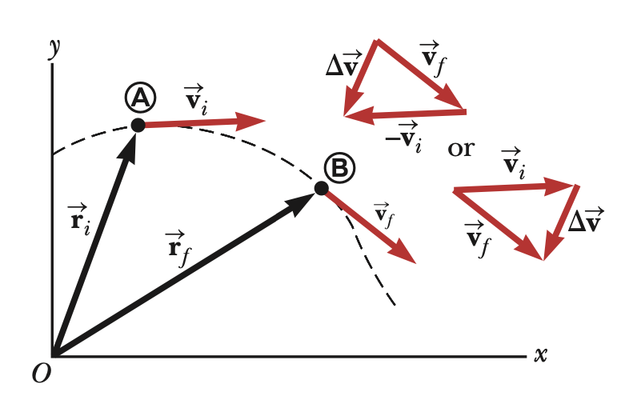
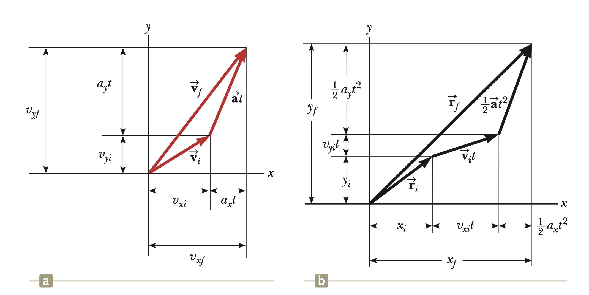
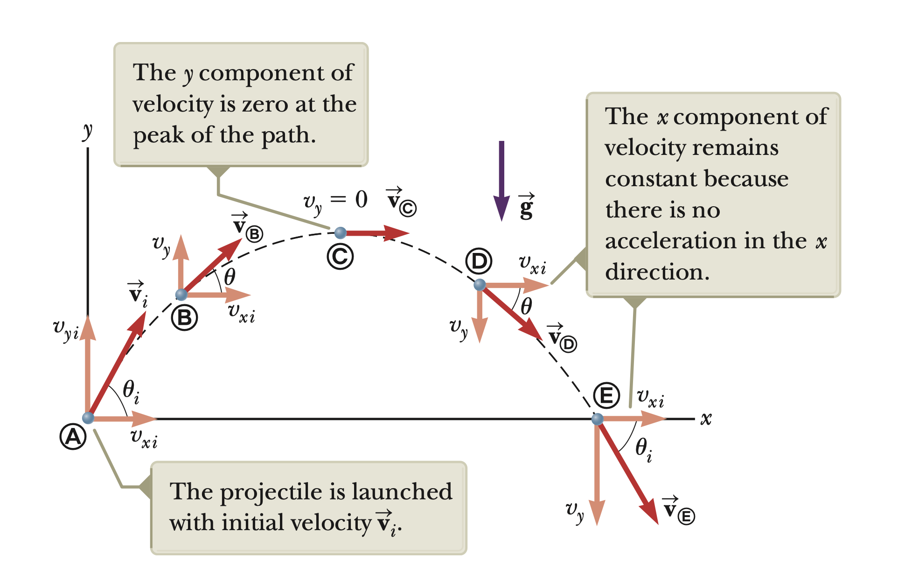
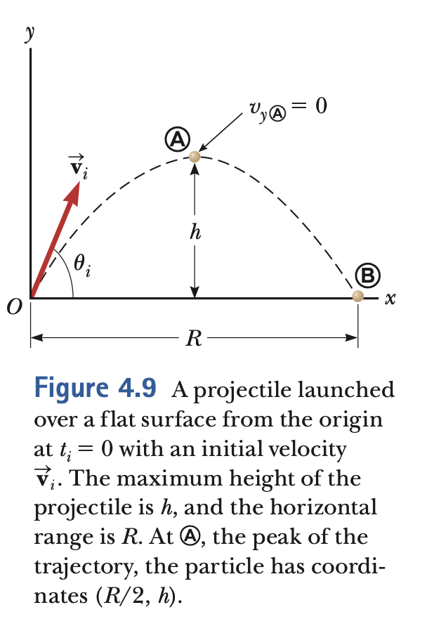
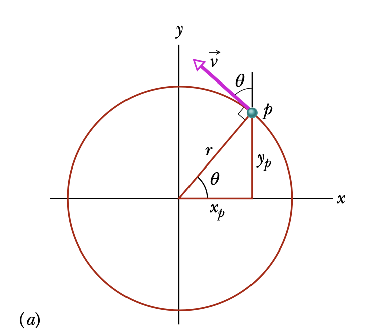
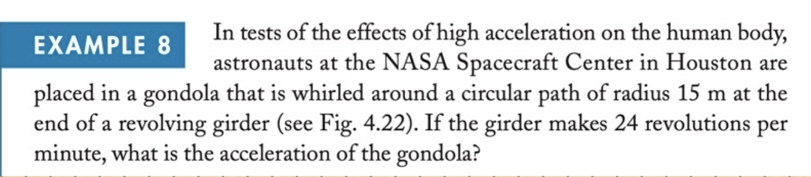

# Motion in 2 Dimensions

## Objectives

- To study vector nature of displacement, velocity and acceleration.
- Projectile motion, Uniform circular motion.
- Concept of relative motion.

<!-- pause -->

## Position, velocity and acceleration

### Position and Displacement

- We extend the idea of position from chp-2 to two dimension x-y. We indicate particle position by its position vector as follows.

```latex +render
$\vec r = x \hat{i}+y \hat{j}+ z \hat{k}$
```

- The displacement then is defined the difference of final versus initial positions.

```latex +render
$\Delta\vec r  = \vec r_2 - \vec r_1$
```

<!--end_slide-->


<!--end_slide-->



<!--end_slide-->



### Average velocity

- As we have defined in 1 dimension average velocity is

```latex +render +width:25%
$\vec v_{avg} = \frac{\Delta\vec r}{\Delta t}$
```

- Note that average velocity is independent of the motion only depends on end points.

<!--end_slide-->

### Instantaneous velocity

- Instantaneous velocity is defined as

```latex +render
$$\vec v =\lim_{\Delta t\to  0}\frac{\Delta\vec r}{\Delta t}=\frac{d \vec r}{dt}=\frac{d}{dt}(x \hat{i}+y\hat{j}+z\hat{k})$$
```

- Each of the components are then

```latex +render
$$v_{x}=\frac{dx}{dt}, \quad v_{y}=\frac{dy}{dt}, \quad v_{z}=\frac{dz}{dt}$$
```



<!--end_slide-->


### Acceleration

- As a particle moves from one point to another along some path, its instantaneous velocity vector changes.

```latex +render +width:35%
$\vec a_{avg} = \frac{\vec v_f - \vec v_i}{t_f -t_i}=\frac{\Delta v}{\Delta t}$
```



<!--end_slide-->

- Similarly instantaneous acceleration will be

```latex +render +width:25%
$$\vec a = \lim_{\Delta t \to 0}\frac{\Delta v}{\Delta t}=\frac{d \vec v}{dt}$$
```

- In components

```latex +render
$$a_{x}=\frac{d v_x}{dt}, \quad a_{y}=\frac{d v_y}{dt}, \quad a_{z}=\frac{d v_z}{dt}$$
```


<!--end_slide-->

## 2D motion with constant acceleration

- The motion in two dimensions can be modeled as two independent motions in each of the two perpendicular directions associated with the x and y axes. That is any influence in the y direction does not affect x.

- Assuming constant acceleration on both axes

```latex +render +width:25%
\[ \vec v_f = \vec v_i + \vec a t \]
\[\vec r_f = \vec r_i + \vec v_i t +\frac{1}{2}\vec a t^{2}\]
```



<!--end_slide-->

## Projectile Motion

-In projectile motion, the horizontal motion and the vertical motion are independent of each other; that is, neither motion affects the other. The position vector and initial velocities are

```latex +render
\[\vec r_f = \vec r_i + \vec v_i t +\frac{1}{2}\vec a t^{2}, \quad v_{ix}= v \cos\theta, \quad v_{iy}= v\sin\theta\]
```



<!--end_slide-->

- The motion on y-direction is with constant acceleration g and the motion on x-direction is constant velocity, therefore the following equations hold
- On the x axis

```latex +render  +width:55%
$v_{xi}=v_{xf},\quad x_{f}=x_{i}+v_{xi}t$
```

- On the y axis

```latex +render
$v_{yf}=v_{yi}-gt$\\
$y_{f}=y_{i}+v_{yi}t-\frac{1}{2}g t^{2}$\\
$v_{yf}^{2}= v_{yi}^{2}-2g(y_f-y_i)$
```

<!--end_slide-->

### Horizontal range and Maximum height



- From the equations we gave before it is easy to show that

```latex +render +width:45%
$h=\frac{v_{i}^{2}\sin\theta^{2}}{2g},\quad R= \frac{v_{i}^{2}\sin 2\theta}{g}$
```

<!--end_slide-->

## Uniform circular motion

> A particle is in uniform circular motion if it travels around a circle or a circular
> arc at constant (uniform) speed. Although the speed does not vary, the particle is
> accelerating because the velocity changes in direction.

```latex +render +width:15%
$a_c= \frac{v^{2}}{r}$
```

<!-- column_layout: [2, 2] -->
<!-- column: 0 -->



<!-- column: 1 -->


<!--end_slide-->

> - _Period_ is defined as the time interval required to complete one revolution.
> - Inverse of the period is _rotation rate_.

- From these we can define the angular speed and acceleration.

<!--pause-->

```latex +render +width:45%
$T=\frac{2\pi r}{v}, \quad \omega=\frac{2\pi}{T},\quad a_c=r \omega^{2}$
```



<!--end_slide-->

## Relative motion

- A _frame of reference_ can be described by a Cartesian coordinate system for which an observer is at rest with respect to the origin.

<!-- column_layout: [2, 2] -->
<!-- column: 0 -->


<!-- column: 1 -->

- Galilean transformations

```latex +render
$\vec{r}_{PA}=\vec{r}_{PB}+\vec{r}_{BA}$\\
$\vec{v}_{PA}=\vec{v}_{PB}+\vec{v}_{BA}$\\
$\vec{a}_{PA}=\vec{a}_{PB}$
```

<!--end_slide-->


<!--end_slide-->


<!--end_slide-->


