# Force and Motion 2

## Objectives

- Define friction force.
- Distinguish between friction in a static situation
  and in a kinetic situation.

<!-- pause -->

## Friction

- When an object is in motion either on a surface or in a viscous medium such as air
  or water, there is resistance to the motion because the object interacts with its surroundings. We call such resistance a force of friction.

- It was first discussed by Leonardo da Vinci.

<!--pause-->

> The magnitude of the friction force between unlubricated, dry surfaces sliding one
> over the other is proportional to the magnitude of the normal force acting on the
> surfaces and is independent of the area of contact and of the relative speed.


<!--end_slide-->

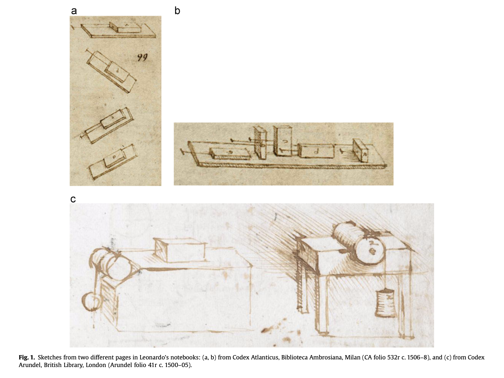

<!--end_slide-->


<!--end_slide-->

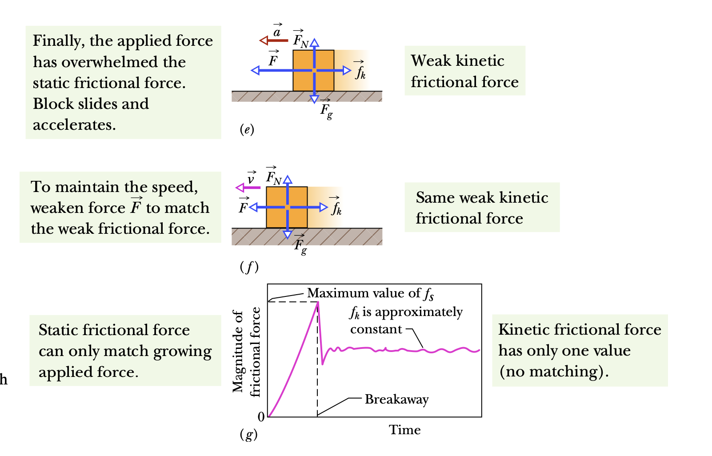

<!--end_slide-->

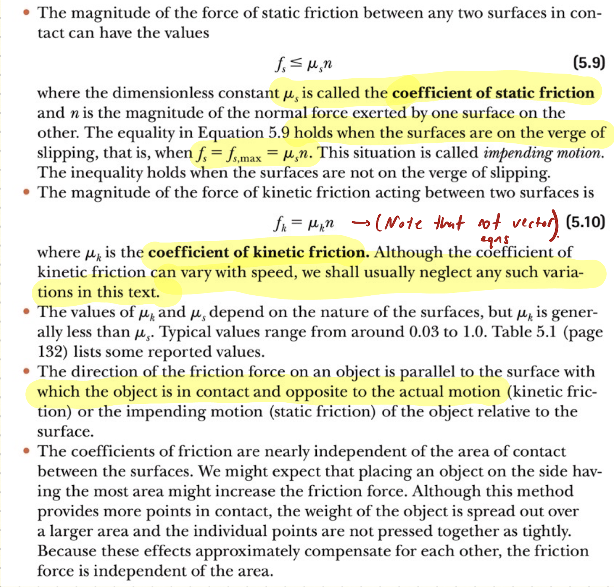

<!--end_slide-->

- The “law” of friction lacks the general validity of, say, Newton’s laws.
  It is only approximately valid, and it is phenomenological, which means that it is merely
  a descriptive summary of empirical observations which does not rest on any detailed
  theoretical understanding of the mechanism that causes friction.

<!--pause-->


<!--pause-->

- A frictional force is, in essence, the vector sum of many
  forces acting ­ between the surface atoms of one body and those of another body. If
  two highly polished and carefully cleaned metal surfaces are brought together in
  a very good vacuum (to keep them clean), they cannot be made to slide over each
  other.

<!--end_slide-->

- When two ordinary surfaces are placed together, only the high points touch
  each other. (It is like having the Alps of Switzerland turned over and placed down
  on the Alps of Austria.) The actual microscopic area of contact is much less than
  the apparent macroscopic contact area, perhaps by a factor of 10^4.

<!-- column_layout: [2, 2] -->
<!-- column: 0 -->


<!-- column: 1 -->

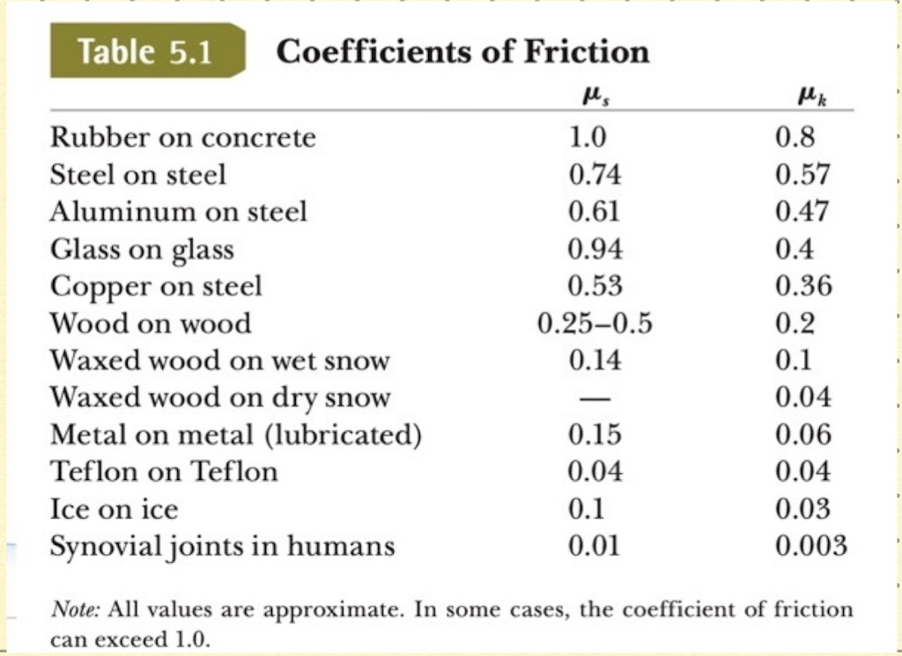

<!--end_slide-->


<!--pause-->

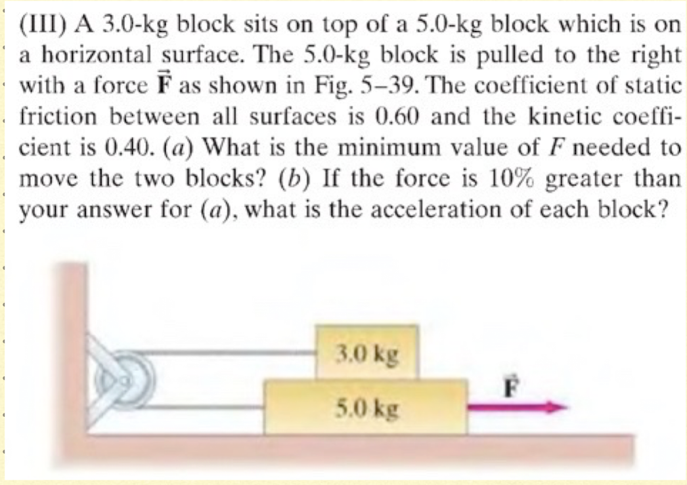

<!--end_slide-->

## Motion in the presence of resistive forces

- Apply the relationship between the drag force on an
  ­ object moving through air and the speed of the object.
- Determine the terminal speed of an object falling
  through air.

<!--pause-->

### Model-1: Resistive Force Proportional to Object Velocity

- If we model the resistive force acting on an object moving through a liquid or gas as
  proportional to the object’s velocity, the resistive force can be expressed as

```latex +render
$\vec R = -b \vec v$
```

<!--pause-->

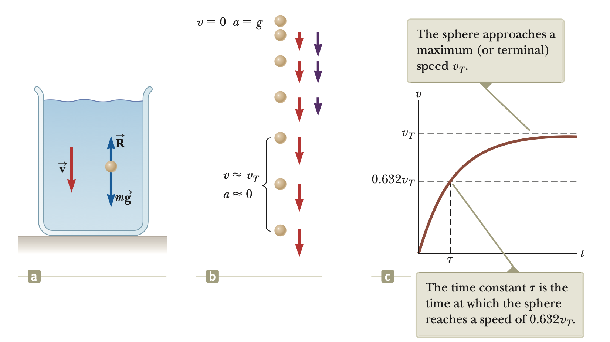

<!--end_slide-->

- From Newton's second law we can write down

```latex +render
$\frac{dv}{dt}=g-\frac{b}{m}v$
```

<!--pause-->

- Terminal velocity is reached when acceleration is zero.

```latex +render
$\frac{dv}{dt}=0, \quad v_T=\frac{mg}{b}$
```

- The solution to the equation above is

```latex +render
$v=\frac{mg}{b}(1-e^{-\frac{bt}{m}})=v_T(1-e^{-\frac{t}{\tau}})$
```

<!--pause-->

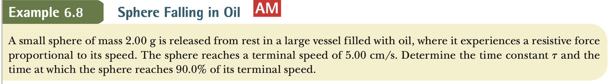

<!--end_slide-->

### Model 2: Resistive Force Proportional to Object Speed Squared

- For objects moving at high speeds through air, such as airplanes, skydivers, cars,
  and baseballs, the resistive force is reasonably well modeled as proportional to the
  square of the speed. In these situations, the magnitude of the resistive force can be
  expressed as

```latex +render
$R=\frac{1}{2}D\rho A v^{2}$
```

<!--pause-->

```typst +render
#set text(font:"DejaVu Sans Mono",10pt)
- D is the dimensionless quantity called drag coefficient.
- $rho$ is the density of air.
- A is the cross-sectional area of the moving object measured in a \ plane perpendicular to its velocity.
```

- Again considering the accelaration is zero when object reaches terminal velocity we find the terminal velocity of an object with mass m as:

```latex +render
$v_T = \sqrt{\frac{2mg}{D\rho A}}$
```

<!--end_slide-->


<!--end_slide-->

## Uniform circular motion

- Recall that when a body moves in a circle (or a circular arc) at constant speed v, it is said to be in uniform circular motion. Also recall that the body has a centripetal acceleration (directed toward the center of the circle) of constant magnitude given by

```latex +render
\begin{equation}
 a_c =\dfrac{v^{2}}{r}
\end{equation}
```


<!--end_slide-->

- From Newton's second law we can write the magnitude of the _centripetal_ force

```latex +render
\begin{equation}
 F = \dfrac{m v^{2}}{r}
\end{equation}
```

<!--end_slide-->
<!--pause-->

## Non-uniform circular motion (extra)

- In uniform circular motion we only had the radial acceleration, question is what happens when we also have the tangential one?


<!--end_slide-->

### Problems

<!-- column_layout: [3, 3] -->
<!-- column: 0 -->

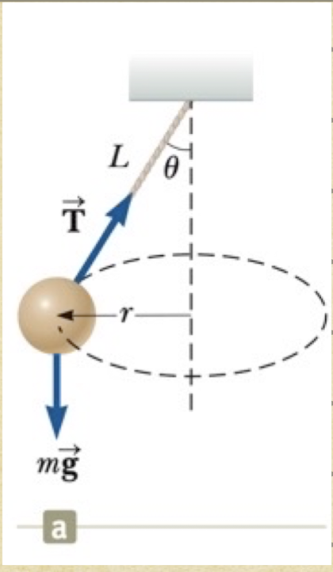

<!--pause-->
<!-- column: 1 -->

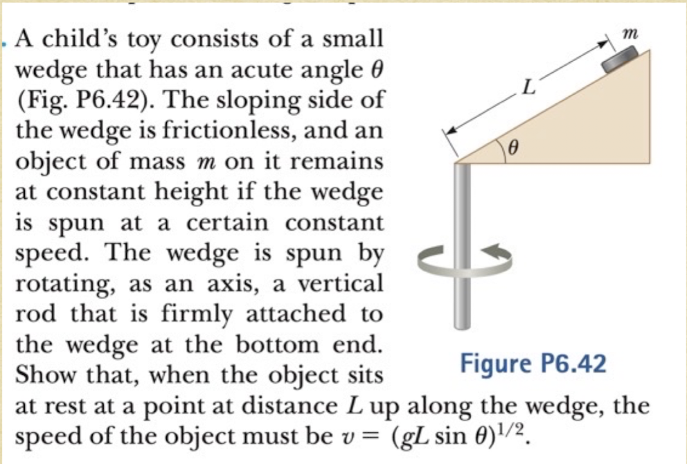

<!--end_slide-->

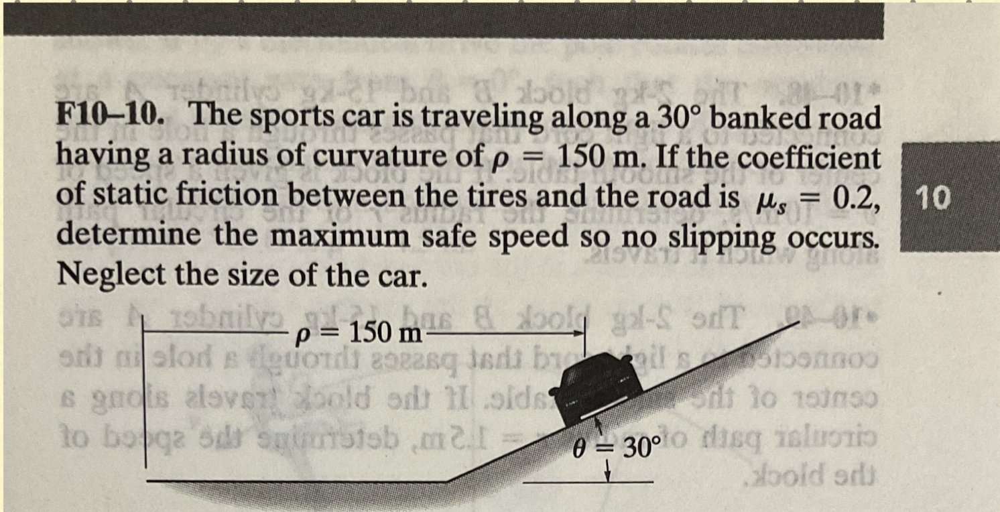

<!--pause-->

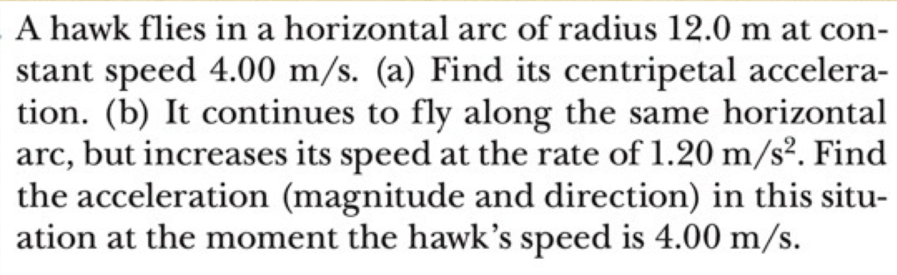

<!--end_slide-->


