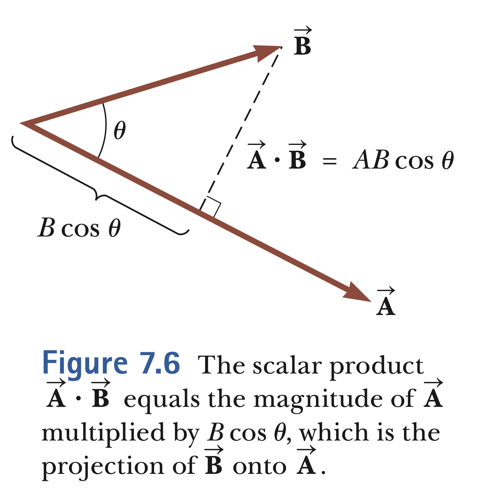
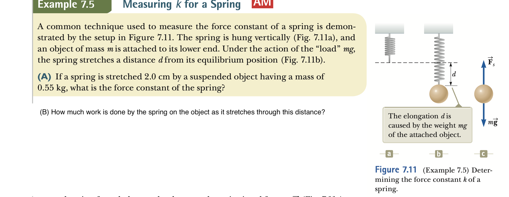
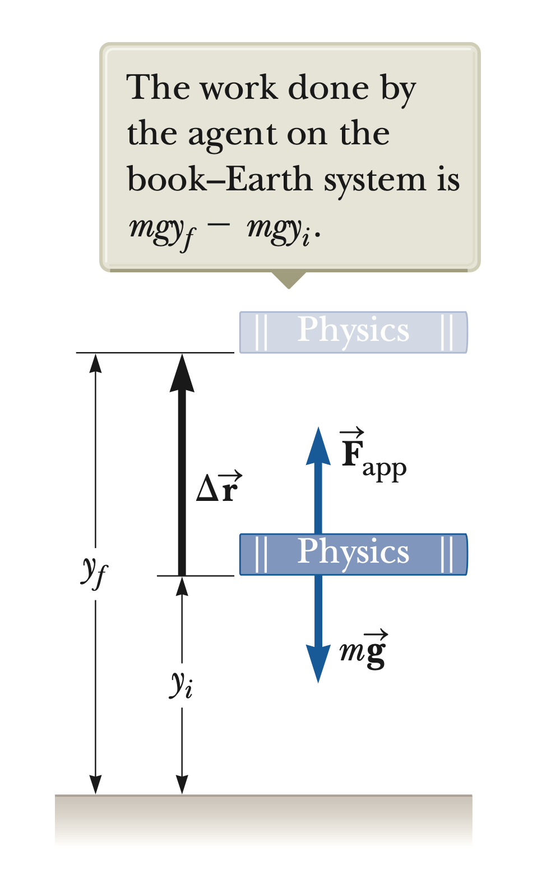
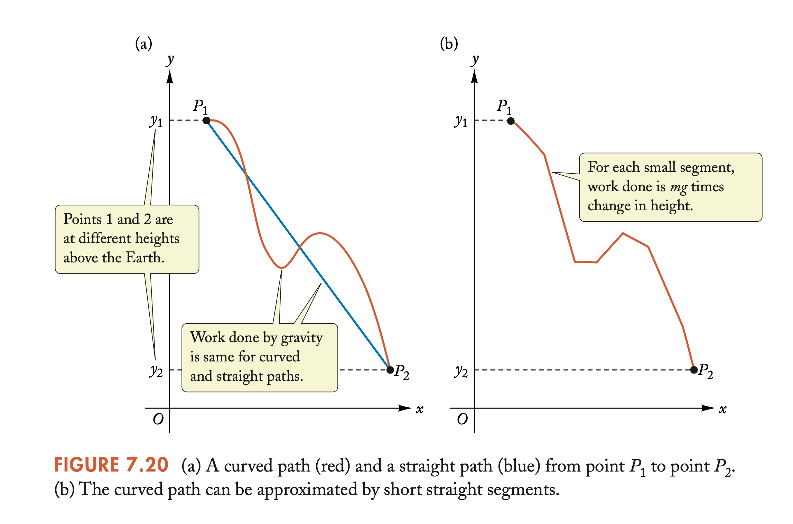
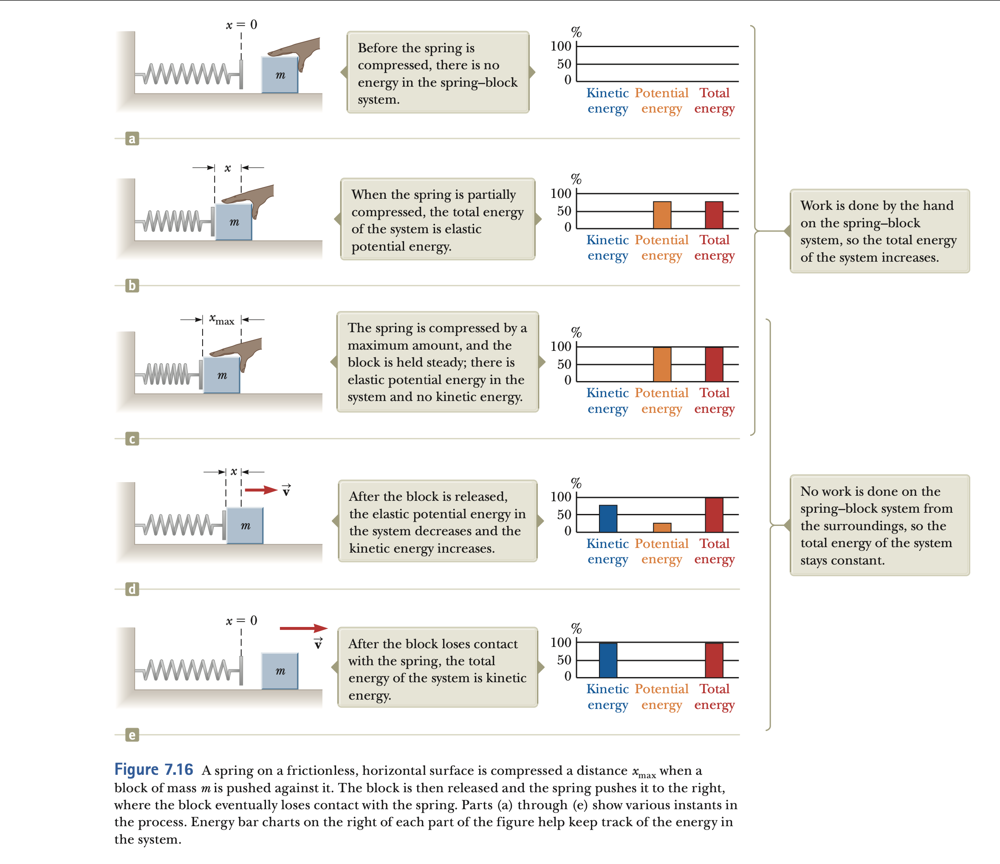

# Energy of a System

- In previous chapters we have used position, velocity, acceleration
  and Newton's laws to solve variety of problems. However, some
  problems are really **difficult** to solve with those approach.
  In this chapter and following one we will introduce new
  concepts **energy and momentum** which will help us to understand
  physics and solve problems in an easier way.

<!-- pause -->

<!-- new_line -->

- The concept of **energy** is one of the most important topics in
  science and engineering. We can think of energy in terms of fuel
  for transportation and heating, electricity for lights and so on.
  However, these ideas do not truly define energy concept we use in physics.

<!-- pause -->

# System and Environment

In a system model, we focus our attention to a **small portion of the
universe**, and ignore the details of the rest of the universe.

<!-- pause -->

A valid system

> - may be a single object or particle
> - may be a collection of objects or particle
> - may be a region of space
> - may vary with time or shape

No matter what the particular system is given in a problem we first identify the
**system boundary**: an imaginary surface that divides the universe into a system
and the environment surrounding the system.

<!-- end_slide -->

# Work Done by a Constant Force

```typst +render
#set text(font:"Dejavu Sans Mono",13pt)
The work $W$ done on a system by an agent exerting a constant force on the \
system is the product of the magnitude of $F$ of the force, the magnitude \
$Delta r$ of the displacement of the point of application of the force, and \
$cos theta$, where $theta$ is the angle between the force and displacement of
vectors:
#set align(center)
$ W=F Delta r cos theta $
```


<!-- pause -->

<!--end_slide-->

```typst +render
#set text(font:"Dejavu Sans Mono",7pt)
- Note that if the force is perpendicular to the displacement,\ that force does no work.
- The units of work Joules=Newton x meter.
- The sign of the work depends on the angle between $F$ and $Delta r$.
```

You must think of work as an "energy transfer". If the work W is done positive then energy is transferred **to the system**, if negative then energy is
transferred **from the system**.


<!--end_slide-->

# The Scalar Product of Two vectors

For the definition of work it is convenient to define the scalar (dot) product of two vectors:

```typst +render
#set text(font:"Dejavu Sans Mono",10pt)
#set align(center)
$arrow( A).arrow(B)=|arrow(A)||arrow(B)| cos theta$
```



has the following properties:

```typst +render
#set text(font:"Dejavu Sans Mono",10pt)
- $arrow( A).arrow(B)=arrow(B)arrow(A)$
- $arrow( A).(arrow(B)+arrow(C))=arrow(A).arrow(B)+arrow(A).arrow(C)$

```

<!-- end_slide -->

# Work Done by a Varying Force

Consider a particle being displaced on x-axis under the action of a force that varies with position. For small displacement we have the work

```typst +render
$ W tilde.op F_x Delta x $
```


<!-- pause -->

Then as the size of the displacements goes to 0, the total work done will be

```latex +render
\[ \lim_{x\to 0}\sum_{x_i}^{x_f}F_x \Delta x= \int_{x_i}^{x_f}F_x dx \]

```

<!--end_slide-->

## Work done by spring

A common model on which the force varies with position is the spring force. For many springs, if the spring is either streched or compressed small distance from equilibrium then it exerts a force.

```latex +render
$F_x = -kx.$

```

<!--pause-->


After integrating we find the following result for the work done by the spring.

```latex +render
$W_s = -\frac{1}{2}k(s_{2}^2-s_{1}^2).$
```

<!--end_slide-->



<!--end_slide-->

# Kinetic Energy and the Work-Kinetic Energy theorem

<!--column_layout: [1,2]-->

<!--column: 1-->

<!--new_line-->

<!--new_line-->

Consider a system with a single particle as in the left figure. From second law and definition of work we can show that.

```typst +render
$W_"ext"=1/2 m(v_f^2-v_i^2)$
```

<!--column: 0-->


<!--column_layout: [1]-->

<!--pause-->
<!--column: 0-->

```typst +render
#set text(font:"Dejavu Sans Mono",9pt)
The work done on a particle by net force  $sum arrow(F)$   acting on it \  equals to the change in kinetic energy of the particle.
#set align(center)
The quantity is  important and called kinetic energy \
$K=1/2 m v^2$ and $W_"ext" = K_f - K_i = Delta K $
```

The kinetic energy represents the capacity of a particle to do work "**by virtue of its speed**".

<!--end_slide-->

# Potential Energy of a System

<!--column_layout: [1,1]-->

<!--column: 1-->



<!--column: 0-->

Let us imagine a system consisting of a book and the Earth, interacting via the
gravitational force. We do some work on the system by lifting the book slowly from
rest through a vertical displacement

<!--pause-->

```typst +render
$W_"ext"= arrow(F)_"app" . Delta arrow(r) = m g hat(j) . (y_f hat(j) - y_i hat(j) ) $
```

<!--pause-->

We can define the gravitational potential energy as

```typst +render
$U_g = m g y => W_"ext"= Delta U $
```

Then the potential energy is the capacity of a particle to do work by **virtue of its position in space**.

<!--end_slide-->



- Note that the work done by gravity is the minus of potential energy i.e.

```latex +render
$W_{ext}=\Delta U, \quad W_{grav}=-\Delta U$
```

<!--end_slide-->

## Elastic potential energy

- Remember we have defined work done by the spring as

```latex +render
$W_{s}=-\frac{1}{2}k(x_2^{2}-x_1^{2})$
```

- If we define the elastic potential energy as

```latex +render
$U =\frac{1}{2}k x^{2}$
```

- Then the work done by the spring will be the minus of potential energy

```latex +render
$W_{s}=-\Delta U$
```

<!--end_slide-->



<!--end_slide-->

## Power

```typst +render
#set text(font:"DejaVu Sans Mono",7pt)
- The time rate at which work is done by a force is said to be the power due to the \
force. If a force does an amount of work W in an amount of time $Delta t$, the average \
power due to the force during that time interval is
```

```latex +render
$ P_{avg}=\frac{W}{\Delta t}$
```

<!--pause-->

- The instantaneous power P is the instantaneous time rate of doing work, which
  we can write as

```latex +render
$ P=\frac{d W}{d t}$
```

<!--pause-->

- The S.I. unit for power is _Watt_ named after James Watt, who
  greatly improved the rate at which steam engines could do work.

- Below are some conversions between used units

> - 1 watt = 1 W = 1 J / s = 0.738 ft ⋅ lb / s
> - 1 horsepower = 1 hp = 550 ft ⋅ lb / s = 746 W.

<!--end_slide-->

- For a particle under constant force F. We can also write the instantaneous power as

```latex +render
$ P=\vec {F}\cdot \vec v$
```

- Efficiency is defined as

```latex +render
$ \varepsilon=P_{output}/P_{input} $
```

<!--pause-->


<!--end_slide-->


