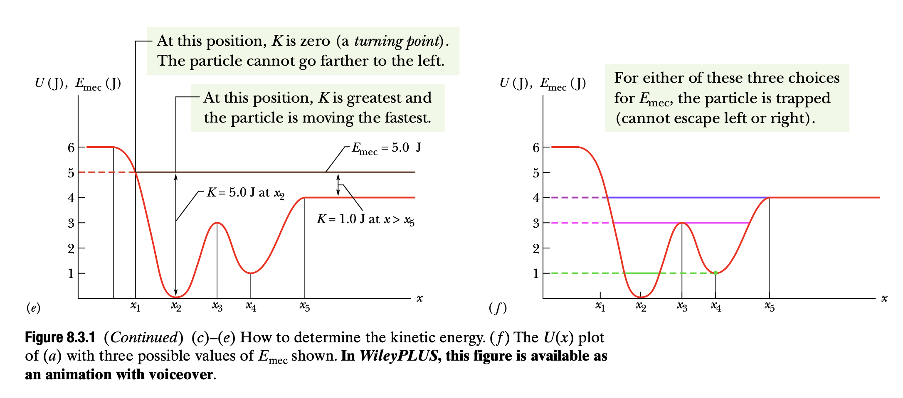
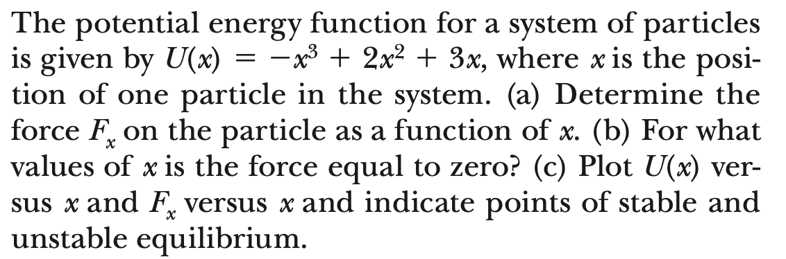
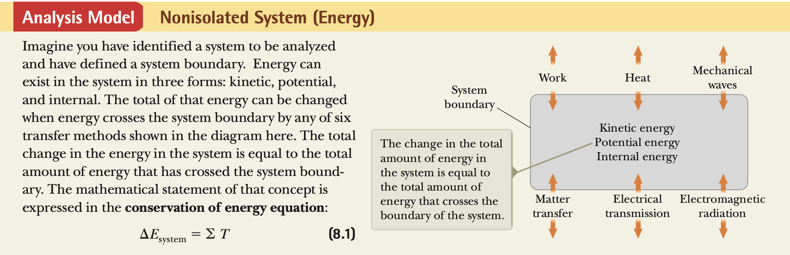
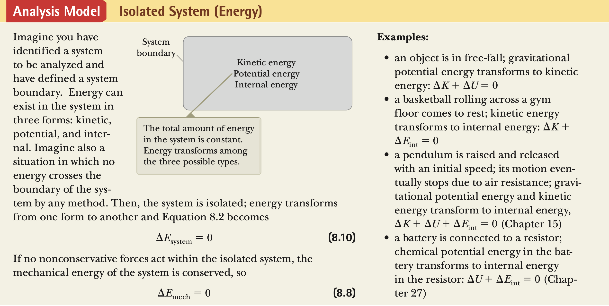
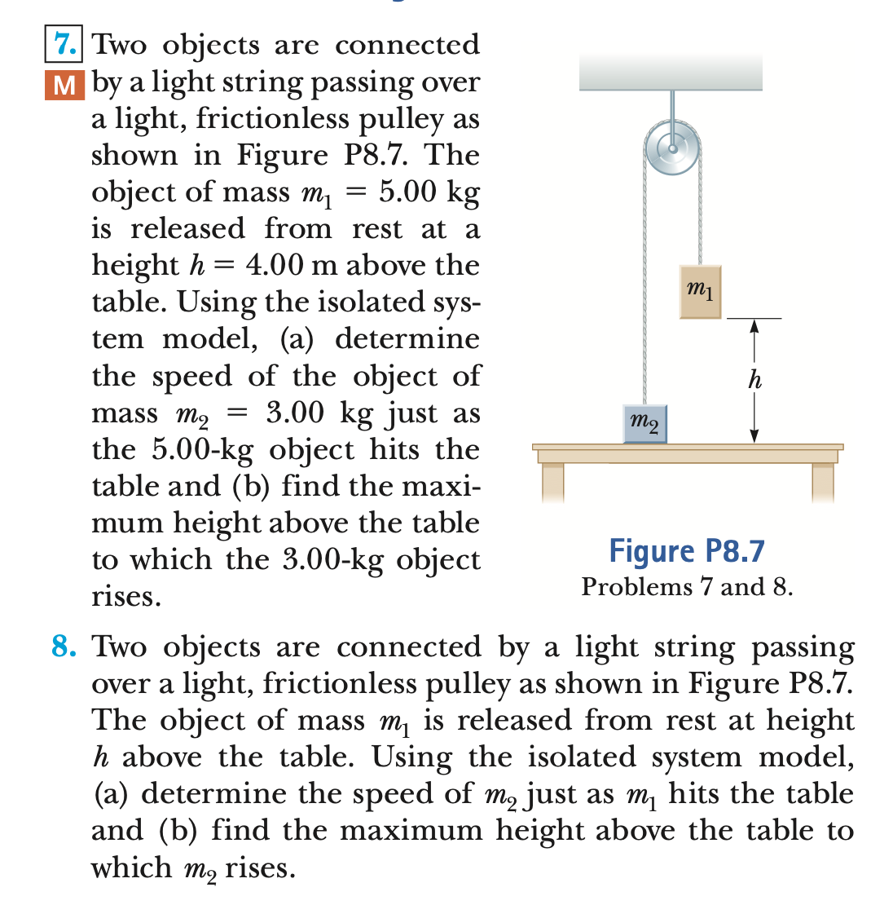
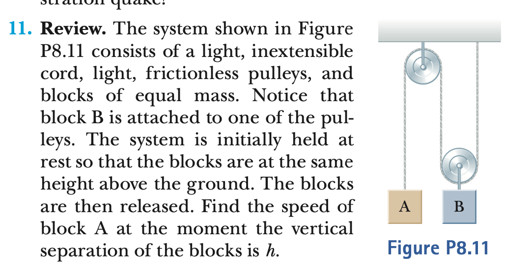

# Chapter 8 -- Conservation of Energy

## Conservation of mechanical energy

- If the only force acting on the particle is gravity we can obtain a relation between potential energy and kinetic energy.

<!--pause-->

- Remember the change of kinetic energy equals the net work done on the particle; that is

```latex +render +width:40%
$W = \Delta K = K_2 -K_1 = \frac{1}{2}(v_{2}^{2}-v_{1}^{2})$
```

- And since the particle is only under the influence of gravitational force, the work done by gravitational force is minus of the gravitational energy U.

```latex +render +width:60%
$W = - \Delta U = -(U_2-U_1),\quad where \,\, U(x)=-\int_{x_0}^{x}F_x(x')dx'$
```

<!--pause-->

- Equating the work done in we find

```latex +render +width:20%
$ K_{2}+U_{2}=K_{1}+U_{1}$
```

- The sum of the kinetic and potential energies is called the _mechanical energy_ of the
  particle. It is usually designated by the symbol E:

```latex +render +width:40%
$ E=K+U =\frac{1}{2}mv^{2}+mgy = constant$
```

<!--end_slide-->

> This is the Law of Conservation of Mechanical Energy.

```latex +render +width:40%
$ E=K+U = constant$
```


<!--end_slide-->

- Now imagine we use spring force instead of gravitational. We already know the work done by spring is again negative of the potential energy that is

```latex +render +width:40%
$W_{spring} = -\Delta U = -(U_2-U_1) = \frac{1}{2}k(x_{1}^{2}-x_{2}^{2})$
```

- Using the same idea before we can define the mechanical energy for spring-mass system

```latex +render +width:40%
$ E=K+U =\frac{1}{2}mv^{2}+\frac{1}{2}kx^{2} = constant$
```

<!--pause-->

## Conservative and Non-conservative Forces

- In order to generalise the idea of mechanical energy to any other force, the work performed by this force can be expressed as a difference between two potential energies, that is,

```latex +render +width:30%
$W = -\Delta U = -(U_2-U_1)$
```

<!--pause-->

> - If the force meets this requirement the force is called _conservative_, otherwise its _non-conservative_.
> - Thus, the force of gravity and the force of a spring are conservative forces.

> The requirement of zero work for a round trip can be used to discriminate between conservative and nonconservative forces.

> One good example is friction forces. We can not formulate a conservation of mechanical energy for the systems with friction force. But later we see we can formulate a more general law of conservation of energy, involving kinds of energy other than mechanical, which remains valid even when there is friction.

<!--end_slide-->

## Force and Potential

- Given the force we can write down the potential energy. What about the other way ? Given potential how do we write down the force?

```latex +render
$F_{x}= -\frac{dU}{dx}$
```

<!--pause-->

- If a particle of some given energy is moving in one dimension under the influence of a conservative force, then we can calculate the speed of the particle as a function of position.

```latex +render +width:25%
$v^{2}=\frac{2}{m}[E-U(x)]$
```

<!--pause-->

```typst +render
#set text(font:"DejaVu Sans Mono",10pt)
If U(x) is increasing and the particle reaches a point at which U(x)=E, then v=0; that \
is, the particle will stop at this point, and its motion will reverse. Such a point is called \
a *turning point of the motion*.
```

> A point where the force is zero, is called an _equilibrium point_.

- In the stable equilibrium point, after a small displacement the force pushes the particle back toward that point.
- In the unstable equilibrium point, after a small displacement the force pushes the particle away from the point
- The neutral equilibrium point no force acts nearby.

<!--end_slide-->


<!--end_slide-->


<!--end_slide-->





<!--end_slide-->

## Conservation of energy

- The general statement of the principle of conservation of energy can
  be described mathematically with the conservation of energy equation as follows:

```latex +render
$\Delta E_{system}= \sum T$
```

where E is the total energy of the system, including all methods of energy storage (kinetic, potential, and internal), and T (for transfer) is the amount of energy transferred across the system boundary by some mechanism.

<!--pause-->

### Non-Isolated system



<!--end_slide-->

### Isolated system

- In isolated systems nothing goes out of or into the boundary i.e.

```latex +render
$\Delta E_{system}= 0$
```



<!--end_slide-->

- In previous section we discussed conservation of mechanical energy where the external forces can be written as a derivative of a potential.


- So how do we include the non-conservative forces such as friction to the conservation law?

<!--end_slide-->

- Simply add it to the work done on the system as the thermal energy.

```latex +render
$W= \Delta E_{mech}+\Delta E_{thermal}$
```


<!--end_slide-->



<!--end_slide-->


<!--end_slide-->



<!--end_slide-->


<!--end_slide-->


